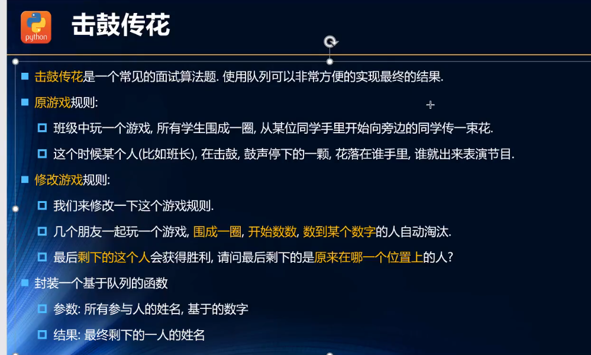
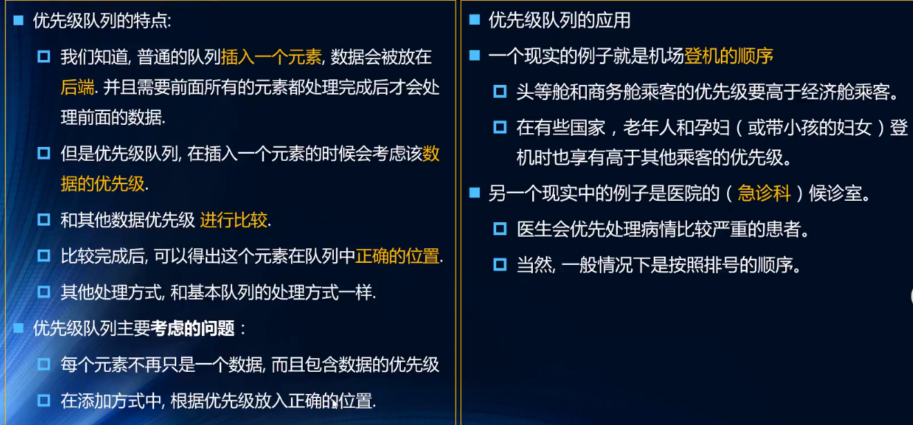

## JS数据结构与算法
### 一、数组
### 二、栈
#### 实现方式
1. 基于链表实现
2. 基于数组实现 -- 代码如下
```javascript
<script type='text/javascript'>
// 封装栈类
function Stack () {
  // 栈中的属性
  this.items = []
  // 栈的相关操作
  // push方法 -- 添加一个元素到栈顶位置
  Stack.prototype.push = function (element) {
    this.items.push(element)
  }
  // pop方法 -- 移除栈顶元素，同时返回被移除元素
  Stack.prototype.pop = function () {
    return this.items.pop()
  }
  // peek方法：返回栈顶元素，不对栈做任何修改
  Stack.prototype.peek = function () {
    return this.items[this.items.length - 1]
  }
  // isEmpty方法
  Stack.prototype.isEmpty = function () {
    return this.items.length === 0
  }
  // size():返回栈的元素个数
  Stack.prototype.size = function () {
    return this.items.length
  }
  // toString方法，将栈结构的内容以字符形式返回
  Stack.prototype.toString = function () {
    let resultString = ''
    for (let i=0; i<this.items.length; i++) {
      resultString += this.items[i] + ' '
    }
    return resultString
  }
}
</script>
```
#### 十进制转二进制
```javascript
// 十进制转二进制
function dec2Bin (decNumber) {
  let stack = new Stack()
  while (decNumber > 0) {
    // 获取余数放入栈中
    stack.push(decNumber % 2)
    decNumber = Math.floor(decNumber / 2)
  }
  let binString = ''
  while (!stack.isEmpty()) {
    binString += stack.pop()
  }
  return binString
}
```
### 三、队列
#### 实现方式
1. 基于链表实现
2. 基于数组实现
```javascript
<script type='text/javascript'>
  function Queue () {
      this.items = []
      // 向队列尾部添加一个或多个元素
      Queue.prototype.enqueue = function (element) {
        this.items.push(element)
      }
      // 移除队列的第一项，返回被移除的元素
      Queue.prototype.dequeue = function () {
        return this.items.shift()
      }
      // 返回队列中的第一个元素，不改变队列结构
      Queue.prototype.front = function () {
        return this.items[0]
      }
      //isEmpty方法
      Queue.prototype.isEmpty = function () {
        return this.items.length === 0
      }
      // size方法
      Queue.prototype.size = function () {
        return this.items.length
      }
      // toString方法
      Queue.prototype.toString = function () {
        let resultString = ''
        for (let i=0; i<this.items.length; i++) {
          resultString += this.items[i] + ' '
        }
        return resultString
      }
  }
</script>
```
#### 击鼓传花
1. 规则



2. 代码实现
```javascript
/// 击鼓传花
function passGame (nameList, num) {
  let queue = new Queue()
  let index = 0
  // 将所有元素加入队列
  for (let i=0; i<nameList.length; i++) {
    queue.enqueue(nameList[i])
  }
  while (queue.size() > 1) {
    /**
     * 开始数数字
     * 不是num的时候，重新加入到队列的末尾
     * 是number的时候，将其从队列删除
    */
    for (let i=0; i<num-1; i++) {
      queue.enqueue(queue.dequeue())
    }
    // 是num的时候直接删除
    queue.dequeue()
  }
  let end = queue.front()
  return nameList.indexOf(end)
}
nameList = ['Lili', 'Lucy', 'Tom', 'Lilei', 'why']
alert(passGame(nameList, 3))// 3
```
#### 优先级队列
1. 优先级队列简介



2. 代码实现
```javascript
<script type='text/javascript'>
    function PriorityQueue () {
      function QueueElement (element, priority) {
        this.element = element
        this.priority = priority
      }
      // 封装属性
      this.items = []
      // 插入方法
      PriorityQueue.prototype.enqueue = function (element, priority) {
        let queueelement = new QueueElement(element, priority)
        if (this.items.length === 0) {
          this.items.push(queueelement)
        } else {
          let add = false
          for (let i=0; i<this.items.length; i++) {
            if (queueelement.priority < this.items[i].priority) {
              this.items.splice(i, 0, queueelement)
              add = true
              break
            }
          }
          if (!add) {
            this.items.push(queueelement)
          }
        }
      }
      // 移除队列的第一项，返回被移除的元素
      PriorityQueue.prototype.dequeue = function () {
        return this.items.shift()
      }
      // 返回队列中的第一个元素，不改变队列结构
      PriorityQueue.prototype.front = function () {
        return this.items[0]
      }
      //isEmpty方法
      PriorityQueue.prototype.isEmpty = function () {
        return this.items.length === 0
      }
      // size方法
      PriorityQueue.prototype.size = function () {
        return this.items.length
      }
      // toString方法
      PriorityQueue.prototype.toString = function () {
        let resultString = ''
        for (let i=0; i<this.items.length; i++) {
          resultString += this.items[i].element + '-' + this.items[i].priority + ' '
        }
        return resultString
      }
    }
    // 测试代码
    let qq = new PriorityQueue()
    qq.enqueue('aaa', 1)
    qq.enqueue('bbb', 2)
    qq.enqueue('ccc', 3)
    alert(qq)
</script>
``` 
### 四、链表
#### 单向链表
```javascript
function LinkedList () {
  // 节点类
  function Node (data) {
    this.data = data
    this.next = null
  }
  this.head = null
  this.length = 0
  // append方法,在末尾添加节点
  LinkedList.prototype.append = function (data) {
    // 先创建一个新节点
    let newNode = new Node(data)
    // 判断是否添加的是第一个节点
    if (this.length === 0) { // 是第一个节点
      this.head = newNode
    } else {
      let current = this.head
      while (current.next) {
        current = current.next
      } 
      current.next = newNode
    }
    this.length += 1
  }
  // insert方法
  LinkedList.prototype.insert = function (position, data) {
    // 越界判断
    if (position < 0 || position > this.length) return false
    let newNode = new Node(data)
    // 判断插入的位置是否是第一个
    if (position === 0) {
      newNode.next = this.head
      this.head = newNode
    } else {
      let current = this.head
      let index = 0
      let previous = null
      while (index++ < position) {
        previous = current
        current = current.next
      }
      newNode.next = current
      previous.next = newNode
    }
    this.length += 1
    return true
  }
  // toString方法
  LinkedList.prototype.toString = function () {
    let resultString = ''
    let current = this.head
    while (current) {
      resultString += current.data + ' '
      current = current.next
    }
    return resultString
  }
  // updata方法
  LinkedList.prototype.get = function (position) {
    if (position < 0 || position >= this.length) return null
    // 获取对应的数据
    let current = this.head
    let index = 0
    while (index++ < position) {
      current = current.next
    }
    return current.data
  }
  LinkedList.prototype.indexOf = function (data) {
    let current = this.head
    let index = 0
    while (current) {
      if (current.data === data) {
        return index
      }
      current = current.next
      index += 1
    }
    return -1
  }
  LinkedList.prototype.update = function (position, newData) {
    if (position < 0 || position >= this.length) return false
    let current = this.head
    let index = 0
    while (index++ < position) {
      current = current.next
    }
    current.data = newData
    return true
  }
  LinkedList.prototype.removeAt = function (position) {
    if (position < 0 || position >= this.length) return null
    let current = this.head
    if (position === 0) {
      this.head = this.head.next
    } else {
      let previous = null
      let index = 0
      while (index++ < position) {
        previous = current
        current = current.next
      }
      previous.next = current.next
    }
      this.length -= 1
      return current.data
  }
  // remove方法：从列表中移除一项
  LinkedList.prototype.remove = function (data) {
    // 获取移除的哪一项的位置信息
    let index = this.indexOf(data)
    // 根据位置信息删除节点
    return this.removeAt(index)
  }
  LinkedList.prototype.size = function () {
    return this.length
  }
  LinkedList.prototype.isEmpty = function () {
    return this.length === 0
  }
}
```
#### 双向链表 