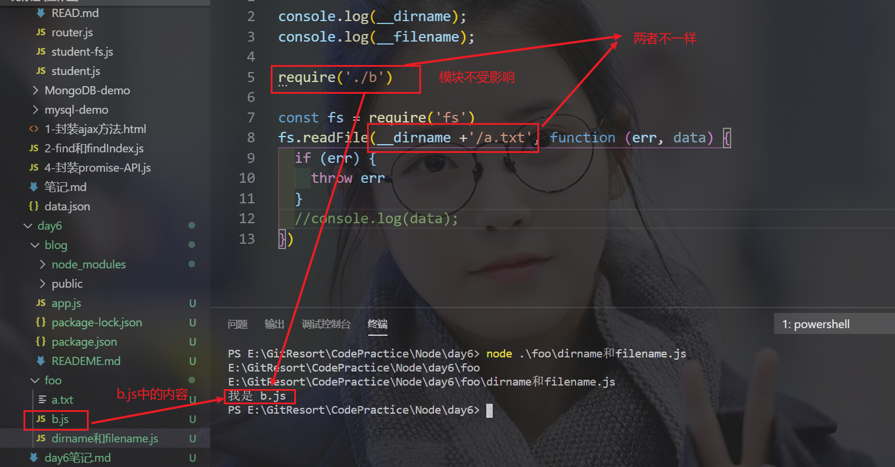
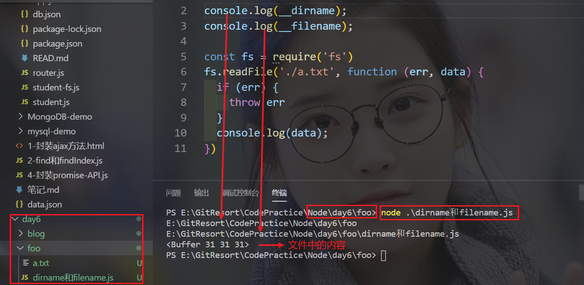
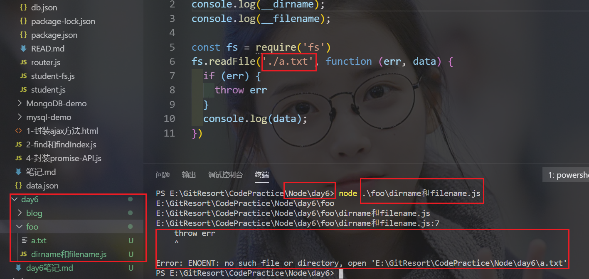
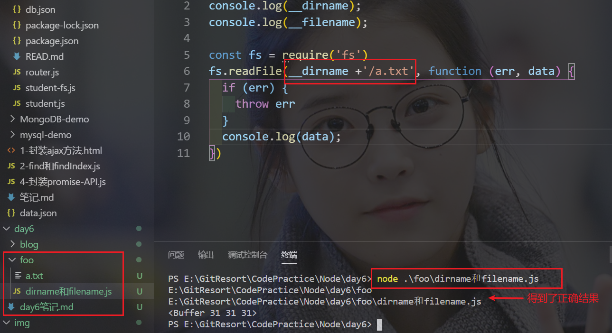

## day6笔记
### 一、path路径操作模块
#### 1.1 path.basename()
1. 语法： path.basename(path, [ext])
   -  ext: 可选的文件扩展名
2. path.basename()方法返回path的最后一部分,尾部的目录分隔符将被忽略
```javascript
path.basename('/foo/bar/baz/asdf/quux.html');
// 返回: 'quux.html'

path.basename('/foo/bar/baz/asdf/quux.html', '.html');
// 返回: 'quux'
```
#### 1.2 path.delimiter()
1. 作用:提供平台特定的路径定界符
   - `;` 用于 Windows
   - `:` 用于POSIX
```javascript
/* POSIX */
console.log(process.env.PATH);
// 打印: '/usr/bin:/bin:/usr/sbin:/sbin:/usr/local/bin'
process.env.PATH.split(path.delimiter);
// 返回: ['/usr/bin', '/bin', '/usr/sbin', '/sbin', '/usr/local/bin']

/* windows */
console.log(process.env.PATH);
// 打印: 'C:\Windows\system32;C:\Windows;C:\Program Files\node\'
process.env.PATH.split(path.delimiter);
// 返回: ['C:\\Windows\\system32', 'C:\\Windows', 'C:\\Program Files\\node\\']
```
#### 1.3 path.dirname()
1. 语法：path.dirname(path)
2. 作用: path.dirname()方法返回path的目录名
3. 如果path不是字符串，则抛出TypeError
```javascript
path.dirname('/foo/bar/baz/asdf/quux');
// 返回: '/foo/bar/baz/asdf'
```
#### 1.4 path.extname()
1. 语法：path.extname(path)
2. 作用:path.extname() 方法返回 path 的扩展名，从最后一次出现`. (句点)`字符到path最后一部分的字符串结束。 如果在 path 的最后一部分中没有`.`，或者如果path的基本名称(参阅 path.basename())除了第一个字符以外没有`.`，则返回空字符串
3. 如果path不是字符串，则抛出TypeError
```javascript
path.extname('index.html');
// 返回: '.html'
path.extname('index.coffee.md');
// 返回: '.md'
path.extname('index.');
// 返回: '.'
path.extname('index');
// 返回: ''
path.extname('.index');
// 返回: ''
path.extname('.index.md');
// 返回: '.md'
```
#### 1.5path.isAbsolute()
1. 语法:path.isAbsolute(path)
2. 作用:path.isAbsolute() 方法检测 path 是否为绝对路径
2. 如果给定的path是零长度字符串，则返回false
4. 如果path不是字符串，则抛出TypeError
```javascript
// 在POSIX上
path.isAbsolute('/foo/bar'); // true
path.isAbsolute('/baz/..');  // true
path.isAbsolute('qux/');     // false
path.isAbsolute('.');        // false
// windows上
path.isAbsolute('//server');    // true
path.isAbsolute('\\\\server');  // true
path.isAbsolute('C:/foo/..');   // true
path.isAbsolute('C:\\foo\\..'); // true
path.isAbsolute('bar\\baz');    // false
path.isAbsolute('bar/baz');     // false
path.isAbsolute('.');           // false
```
#### 1.6 path.join()
1. 语法:path.join([...paths])
2. 作用: path.join()方法使用平台特定的分隔符作为定界符将所有给定的path片段连接在一起，然后规范化生成的路径,零长度的 path 片段会被忽略。如果连接的路径字符串是零长度的字符串，则返回 '.'，表示当前工作目录
3. 如果任何路径片段不是字符串，则抛出TypeError
```javascript
path.join('/foo', 'bar', 'baz/asdf', 'quux', '..');
// 返回: '/foo/bar/baz/asdf'
path.join('foo', {}, 'bar');
// 抛出 'TypeError: Path must be a string. Received {}'
```
#### 1.7 path.parse()
1. 语法: path.parse(path)
2. 作用: path.parse()方法返回一个对象，其属性表示path的重要元素。尾部的目录分隔符将被忽略
3. 返回的对象将具有以下属性：
   - dir
   - root
   - base
   - name
   - ext
4. 在POSIX上
```javascript
path.parse('/home/user/dir/file.txt');
// 返回:
// { root: '/',
//   dir: '/home/user/dir',
//   base: 'file.txt',
//   ext: '.txt',
//   name: 'file' }
```
```javascript
┌─────────────────────┬────────────┐
│          dir        │    base    │
├──────┬              ├──────┬─────┤
│ root │              │ name │ ext │
"  /    home/user/dir / file  .txt "
└──────┴──────────────┴──────┴─────┘
（"" 行中的所有空格都应该被忽略，它们纯粹是为了格式化）
```
5. 在windows上
```javascript
path.parse('C:\\path\\dir\\file.txt');
// 返回:
// { root: 'C:\\',
//   dir: 'C:\\path\\dir',
//   base: 'file.txt',
//   ext: '.txt',
//   name: 'file' }
```
```javascript
┌─────────────────────┬────────────┐
│          dir        │    base    │
├──────┬              ├──────┬─────┤
│ root │              │ name │ ext │
" C:\      path\dir   \ file  .txt "
└──────┴──────────────┴──────┴─────┘
（"" 行中的所有空格都应该被忽略，它们纯粹是为了格式化）
```
6. 如果path不是字符串，则抛出TypeError
### 二、Node中的非模块成员
1. 在每个模块中除了`require`、`exports`等模块相关API之外，还有两个特殊的变量成员
   - `__dirname`: 可以用来**动态**获取当前文件模块所属目录的绝对路径
   - `__filename`:可以用来**动态**获取当前文件的绝对路径
   - `__dirname`和`__filename`是不受执行node命令所属路径影响的
   - 所以在拼接路径的过程中建议多使用`path.join`方法来辅助拼接
   - 为了避免出错，在文件操作中的使用的相对路径都统一转换为**动态的绝对路径**
   - **应该注意：模块中的路径标识和这没关系，不受执行node命令所处位置影响,如下图**



2. `注意这个坑！！`





- 图中的`./a.txt`相对于当前文件路径
- 由上图也可以看出 `./a.txt`相当于执行node命令所处的终端路径
- 第二张图片中的不是错误，Node就是这样设计的，`就是说，文件操作中，相对路径设计的就是相对于执行node命令所处的路径`
- 在文件操作中，使用相对路径是不可靠的，因为在Node中文件操作的路径被设计为相对于node命令所处的路径，所以为了解决这个问题，很简单，只要把相对路径变为绝对路径就可以了
- 这类我们可以使用`__dirname`或者`__filename`来帮我们解决了



### 三、art-template模板的深入使用
#### 3.1 模板继承
1. 抽出每个页面中相同的部分，如头部和尾部，在其他模板中继承使用
#### 3.2子模板
