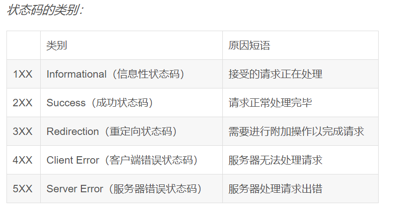

## 常见状态码(statusCode)



### 一、201-206都表示服务器成功处理了请求的状态代码，说明网页可以正常访问
1. 200(成功)  服务器已成功处理了请求。通常，这表示服务器提供了请求的网页。
2. 201(已创建)  请求成功且服务器已创建了新的资源。
3. 202(已接受)  服务器已接受了请求，但尚未对其进行处理
4. 203(非授权信息) 服务器已成功处理了请求，但返回了可能来自另一来源的信息
5. 204(无内容) 服务器成功处理了请求，但未返回任何内容
6. 205(重置内容)  服务器成功处理了请求，但未返回任何内容。与 204 响应不同，此响应要求请求者重置文档视图(例如清除表单内容以输入新内容)
7. 206(部分内容) 服务器成功处理了部分 GET 请求
### 二、300-307表示要完成请求，您需要进一步进行操作。通常，这些状态代码是永远重定向的。
1. 300(多种选择) 服务器根据请求可执行多种操作。服务器可根据请求者 来选择一项操作，或提供操作列表供其选择
2. 301(永久移动)  请求的网页已被永久移动到新位置。服务器返回此响应时，会自动将请求者转到新位置。您应使用此代码通知搜索引擎蜘蛛网页或网站已被永久移动到新位置。 
3. 302(临时移动)  服务器目前正从不同位置的网页响应请求，但请求者应继续使用原有位置来进行以后的请求。会自动将请求者转到不同的位置。但由于搜索引擎会继续抓取原有位置并将其编入索引，因此您不应使用此代码来告诉搜索引擎页面或网站已被移动
4. 303(查看其他位置) 当请求者应对不同的位置进行单独的 GET 请求以检索响应时，服务器会返回此代码。对于除 HEAD 请求之外的所有请求，服务器会自动转到其他位置。
5. 304(未修改) 自从上次请求后，请求的网页未被修改过。服务器返回此响应时，不会返回网页内容
6. 305(使用代理) 请求者只能使用代理访问请求的网页。如果服务器返回此响应，那么，服务器还会指明请求者应当使用的代理
7. 307(临时重定向) 服务器目前从不同位置的网页响应请求，但请求者应继续使用原有位置来进行以后的请求。
### 三、4xx(请求错误)
1. 400(错误请求) 服务器不理解请求的语法。
2. 401(未授权) 请求要求身份验证。 对于需要登录的网页，服务器可能返回此响应。
3. 403(禁止) 服务器拒绝请求。
4. 404(未找到) 服务器找不到请求的网页。
5. 405(方法禁用) 禁用请求中指定的方法
6. 406(不接受) 无法使用请求的内容特性响应请求的网页。
7. 407(需要代理授权) 此状态代码与 401（未授权）类似，但指定请求者应当授权使用代理
8. 408(请求超时) 服务器等候请求时发生超时。
9. 409(冲突) 服务器在完成请求时发生冲突。 服务器必须在响应中包含有关冲突的信息
10. 410 (已删除) 如果请求的资源已永久删除，服务器就会返回此响应。
11. 411 (需要有效长) 服务器不接受不含有效内容长度标头字段的请求
12. 412 (未满足前提条件) 服务器未满足请求者在请求中设置的其中一个前提条件。
13. 413 (请求实体过大) 服务器无法处理请求，因为请求实体过大，超出服务器的处理能力。
14. 414 (请求的 URI 过长) 请求的 URI（通常为网址）过长，服务器无法处理。
15. 415 (不支持的媒体类型) 请求的格式不受请求页面的支持。
16. 416 (请求范围不符合要求) 如果页面无法提供请求的范围，则服务器会返回此状态代码。
17. 417 (未满足期望值) 服务器未满足"期望"请求标头字段的要求
### 四、5xx(服务器错误)
这些状态代码表示服务器在尝试处理请求时发生内部错误。 这些错误可能是服务器本身的错误，而不是请求出错。
1. 500 (服务器内部错误) 服务器遇到错误，无法完成请求。
2. 501 (尚未实施) 服务器不具备完成请求的功能。 例如，服务器无法识别请求方法时可能会返回此代码。

3. 502 (错误网关) 服务器作为网关或代理，从上游服务器收到无效响应。
4. 503 (服务不可用) 服务器目前无法使用（由于超载或停机维护）。 通常，这只是暂时状态。
5. 504 (网关超时) 服务器作为网关或代理，但是没有及时从上游服务器收到请求。
6. 505 (HTTP 版本不受支持) 服务器不支持请求中所用的 HTTP 协议版本。
### 五、访问别的页面
```javascript
  res.statusCode = 302
  res.setHeader('Location', 'url')
```
