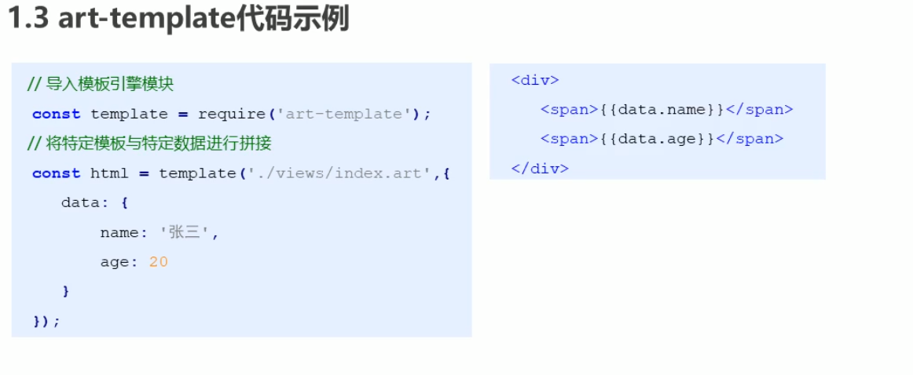

## art-template模板引擎
### 下载与安装
npm install art-template
### 使用
1. 引入模板引擎
```javascript
const template = require('art-template')
```
2. 告诉模板引擎要拼接的数据(一般为对象)和模板
```javascript
const html = template ('模板路径', 数据) 
```



```javascript
// 引入模板引擎
const template = require('art-template')
const path = require('path')
/**
 * template方法用来拼接字符串，参数如下：
 *   1. 模板路径  绝对路径
 *      _dirname 代表当前文件所在路径，app.js在code目录下，所以_dirname会取到code目录下
 *   2. 要在模板中显示的数据，对象类型
 * 该方法返回拼接好的字符串
 *  */ 
// 
// 拼接字符串得到路径
const views = path.join(__dirname, 'views', 'index.html')
const html = template(views, {
  name: '张三',
  age: 20
})
console.log(html);
console.log(__dirname);//E:\GitResort\CodePractice\模板引擎\code
```
### 模板语法
1. art-template同时支持两种模板语法：标准语法和原始语法
2. 标准语法可以让模板更容易读写。原始语法具有强大的逻辑处理能力
3. 标准语法 `{{数据}}`
4. 原始语法 `<%= 数据%>`
#### 输出
1. 普通输出
```html
// 标准语法
<h2>{{value}}</h2>
<h2>{{a ? b : c}}</h2>
<h2>{{a + b}}</h2>
// 原始语法
<h2>{}</h2>
<h2>{}</h2>
<h2>{}</h2>
```
2. 原文输出
如果数据中携带html标签，默认模板引擎不会解析标签，会将其转议后输出，若要使其原文输出，如下
   - {{@ 数据}}
   - <%- 数据 %>
#### 条件判断
在模板中可以根据条件来决定显示那块HTML代码
1. 标准语法
```html
{{if 条件}} ... {{/if}}
{{if v1}} ... {{else if v2 }} ... {{/if}}
```
2. 原始语法
```html
<% if (value) { %> ...  <% } %>
<% if (v1) { %> ... <% } else if (v2) { %> ... <% } %>
```
#### 循环
1. 标准语法
```html
{{each 数据}} 
  {{$index}} {{$value}} // 索引和值
{{/each}}
```
2. 原始语法
```html
<% for (var i=0; i< target.length; i++>) {%> 
    <%= i %> <%= target[i] %>
<% } %>
```
#### 子模版
1. 使用子模版可以将网站公共区块(头部、底部)抽离到单独文件中
2. 标准语法
```html
 {{include '模板路径'}}
```
3. 原始模板
```html
<% include('模板路径') %>
```
#### 模板继承
1. 使用模板继承可以将网站HTML骨架抽离到单独的文件中。其他页面可以继承骨架文件


2. block用于预留位置
```html
<!-- 2-extends.html -->
<!DOCTYPE html>
<html lang="en">
<head>
  <meta charset="UTF-8">
  <meta name="viewport" content="width=device-width, initial-scale=1.0">
  <title>Html骨架模板</title>
  {{block 'head'}} {{/block}}
</head>
<body>
  {{block 'content'}} {{/block}}
</body>
</html>
```
```html
<!-- main.html -->
{{extend './2-extends.html'}}
{{block 'head'}} <link rel="stylesheet" href="style.css"> {{/block}}
{{block 'content'}} <p>uuuuuuuuuu </p> {{/block}}
```
#### 模板配置
1. 向模板中导入变量 template.defaults.imports.变量名 = 变量值
2. 设置模板根目录 template.defaults.root = 模板目录
3. 设置模板默认后缀tempalte.defaults.extname = '.html'
