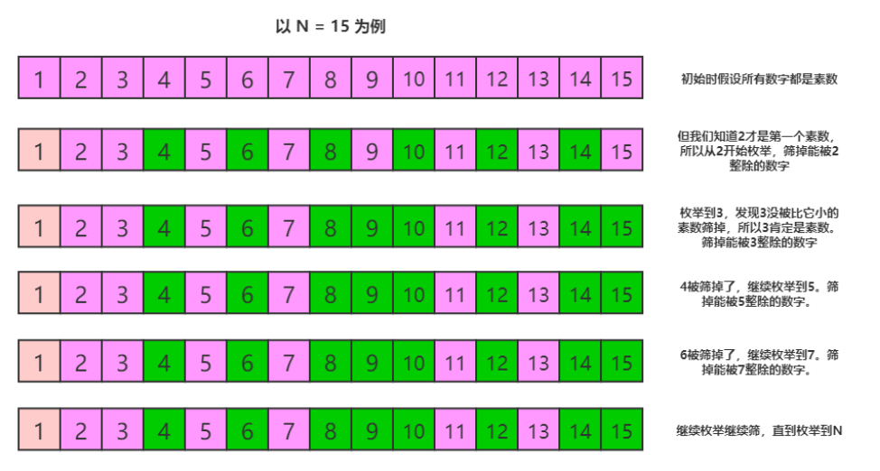

# 914--卡牌分组
> 简单
## 一、题目描述
给定一副牌，每张牌上都写着一个整数。

此时，你需要选定一个数字 X，使我们可以将整副牌按下述规则分成 1 组或更多组:
   - 每组都有 X 张牌。
   - 组内所有的牌上都写着相同的整数。

仅当你可选的 X >= 2 时返回 true

提示：
```javascript
1 <= deck.length <= 10000
0 <= deck[i] < 10000
```
## 二、示例
1. 示例1
```javascript
输入：[1,2,3,4,4,3,2,1]
输出：true
解释：可行的分组是 [1,1]，[2,2]，[3,3]，[4,4]
```
2. 示例2
```javascript
输入：[1,1,1,2,2,2,3,3]
输出：false
解释：没有满足要求的分组。
```
3. 示例3
```javascript
输入：[1]
输出：false
解释：没有满足要求的分组。
```
4. 示例4
```javascript
输入：[1,1]
输出：true
解释：可行的分组是 [1,1]
```
5. 示例5
```javascript
输入：[1,1,2,2,2,2]
输出：true
解释：可行的分组是 [1,1]，[2,2]，[2,2]
```
## 三、解题思路
### 3.1、解题思路
#### 3.1.1 方法一：暴力 -- 枚举所有可行的X，判断是否有满足条件的X即可
1. 什么是约数？--
约数，又称因数。`整数a除以整数b(b≠0)` 除得的商正好是整数而没有余数，我们就说a能被b整除，或b能整除a。a称为b的倍数，`b称为a的约数`

2. 从2开始，从小到大枚举X，由于每一组都有 X 张牌，那么X必须是卡牌总数N的约数，其次，对于写着数字i的牌，如果有count<sub>i</sub> 张，由于题目要求「组内所有的牌上都写着相同的整数」，那么 X 也必须是count<sub>i</sub>	的约数，即：count<sub>i</sub> mod X==0;
所以对于每一个枚举到的X，我们只要先判断X 是否为N的约数，然后遍历所有牌中存在的数字i，看它们对应牌的数量 count<sub>i</sub>是否满足上述要求。如果都满足等式，则X为符合条件的解，否则需要继续令 X增大，枚举下一个数字。
3. 由于已经提及X一定为 count<sub>i</sub>的约数，这个条件是对所有牌中存在的数字i成立的，所以我们可以推出，只有当X为所有 count<sub>i</sub>的约数，即所有 count<sub>i</sub>的最大公约数的约数时，才存在可能的分组。公式化来说，我们假设牌中存在的数字集合为 a, b, c, d, e，那么只有当 X 为:
gcd(count<sub>a</sub> , count<sub>b</sub> , count<sub>c</sub> ,count<sub>d</sub> , count<sub>e</sub>)
的约数时才能满足要求,因此我们只要求出所有count<sub>i</sub>最大公约数 g，判断 g 是否大于等于2即可，如果大于等于2，则满足条件，否则不满足

#### 3.1.2 方法二
> 说实话，没看懂。。。
1. 先了解什么是质数？-- 
质数又称素数，指整数在一个大于1的自然数中，除了1和此整数自身外，没法被其他自然数整除的数。换句话说，只有两个正因数（1和自己）的自然数即为素数。比1大但不是素数的数称为合数。1和0既非素数也非合数

2. 先统计每个数出现的次数，记为数组 arr，记其中最小的值为 min，然后从2到min枚举，看能否有数字可以将arr中的所有元素整除。
3. 有两个剪枝。第一个，如果 min 是1的话,直接返回false;第二个,枚举过程中,在判断能否整除arr所有元素之前，先判断能否整除decks.size()
4. 还可以优化枚举过程，现在的枚举 [2, min] 中的所有数字，其实可以只枚举里面的素数。我先证明一下，设x 是一个素数， y = a*x，a 为大于1的整数。如果 x 不能整除 z，那么对于任意的 y 都不能整除 z。我们可以先用素数筛算法处理出需要的素数，然后再进行枚举。虽然素数筛有一定的时耗，但是当有多组输入时，可以均摊这个时耗
5. 下面来介绍下素数筛：对于一个大于2的整数 x，如果x不是素数，那么必然存在一个素数 p 满足，p < x 且 x%p == 0。反过来讲，如果一个整数 x，存在一个素数 p 满足 x%p == 0，那么 x 必然不是素数，基于这个前提，我们可以设计出一个筛选素数的算法，假设我们要筛选不超过 N 的素数，那么有如下操作：
```c++
//标记数组，如果mark[i] == false 且 i>=2，则认为 i 是素数。初始时假设都是素数
bool mark[N+1] = {0}; 
vector<int> prime; //用来存储素数的容器
for(int i = 2; i <= N; i++) {
    if(mark[i]) { //i 已经被标记为不是素数了，continue
        continue;
    }
    primes.push_back(i); //i是一个素数，放进容器。
    for(int j = i + i; j <= N; j += i) {//筛掉所有能被i整除的数字。
        mark[j] = true;
    }
}
```
代码不好理解，可以看图



6. 最终代码
```c++
bool initFlag = false;
vector<int> primes;
class Solution {
public:
    bool hasGroupsSizeX(vector<int>& deck) {
        if(initFlag == false) {
            initFlag = true;
            bool mark[10000] = {0};
            for(int i = 2; i < 10000; i++) {
                if(mark[i]) {
                    continue;
                }
                primes.push_back(i);
                for(int j = i + i; j < 10000; j += i) {
                    mark[j] = true;
                }
            }
        }

        unordered_map<int, int> cnt;
        for(auto v : deck) {
            cnt[v]++;
        }
        auto minIter = cnt.begin();
        for(auto it = cnt.begin(); it != cnt.end(); it++) {
            if(it->second < minIter->second) {
                minIter = it;
            }
        }
        if(minIter->second <= 1) {
            return false;
        }
        for(auto v : primes) {
            if(deck.size() % v) {
                continue;
            }
            if(v > minIter->second) {
                break;
            }
            bool flag = true;
            for(auto it = cnt.cbegin(); flag && it != cnt.cend(); ++it) {
                if(it->second % v) {
                    flag = false;
                }
            }
            if(flag) {
                return true;
            }
        }
        return false;
    }
};
```
### 3.2、会熟练使用ES6中的Set/Map
### 3.3、熟练使用ES6中关于数组的新增方法
### 3.4、会使用JS求最大公约数
```javascript
// 一、欧里几德算法，辗转相除法
// 递归思想
function gcd(a,b){
    if(b == 0){
        return a;
    }
    var r = a % b;
    console.log(r);
    return gcd(b,r);
}
// 迭代思想
function gcd(a,b){
    var temp;
    while(b != 0){
        temp = a % b;
        a = b;
        b = temp;
    }
    return a;
}
// 二、质因数分解 -- 最原始的解法
function gcd(a,b){
    var result = 1;
    for(var i = 1; i <= a && i <= b; i++ ){
        if(a%i == 0 && b%i == 0 ){
            result = i;
        }
    }
    return result;
}
```
### 3.5、求最小公倍数 -- 两个数的乘积除以最大公倍数
```javascript
function scm(a,b){
    return (a*b)/gcd(a,b);
}
```

## 四、代码实现
```javascript
/**
 * @param {number[]} deck
 * @return {boolean}
 */
// 求最大公因数方法代码
var hasGroupsSizeX = function(deck) {
    let map = new Map()
    for(let n of deck){
        map.set(n,map.has(n)?map.get(n)+1:1)
    }
    let arr = [...map.values()]
    let res = arr[0]
    return arr.every(i => (res = gcd(res, i)) > 1)
};
let gcd = (a, b) => (b === 0 ? a : gcd(b, a % b))
```