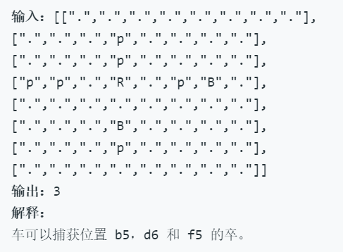

## 999.车的可用捕获量
### 一、问题描述
在一个 8 x 8 的棋盘上，有一个白色车（rook）。也可能有空方块，白色的象（bishop）和黑色的卒（pawn）。它们分别以字符 “R”，“.”，“B” 和 “p” 给出。大写字符表示白棋，小写字符表示黑棋。
车按国际象棋中的规则移动：它选择四个基本方向中的一个（北，东，西和南），然后朝那个方向移动，直到它选择停止、到达棋盘的边缘或移动到同一方格来捕获该方格上颜色相反的卒。另外，车不能与其他友方（白色）象进入同一个方格。
返回车能够在一次移动中捕获到的卒的数量。
### 二、示例
#### 2.1示例1


#### 2.2示例2


#### 2.3示例3




#### 注意
1. board.length == board[i].length == 8
2. board[i][j] 可以是 'R'，'.'，'B' 或 'p'
3. 只有一个格子上存在 board[i][j] == 'R'

### 三、解题思路
1. 对于本题，首先，我们要找到`R`的位置，可以通过暴力遍历的方式获取到`R`的坐标位置
2. 得到了`R`的位置之后，以`R`的位置为起点，分别向四个方向移动，遇到以下情况停止：
   - 超出棋盘边界
   - 遇到象
   - 捕获到卒
#### 那么如何处理车向四个方向移动呢？
1. 首先我们将棋盘抽象成由`X(行)`和`Y(列)`组成，则`X(行)`设定为从西到东方向，`Y(列)`设定为从北到南方向。即上北，下南，左西，右东，则x表示在X上的位置，y表示在Y上的位置。
   - `(0 + x, 1 + y)`：x坐标不变，y前进一格，则是**由西向东移动**
   - `(1 + x, 0 + y)`: y坐标不变，x前进一格，则是**由北向南移动**
   - `(0 + x, -1 + y)`: x坐标不变，y后退一格，则是**由东向西移动**
   - `(-1 + x, 0 + y)`: y坐标不变，x后退一格，则是**由南向北移动**
2. 由此可见，我们可以把`x`的位置移动由数组`[0, 1, 0, -1]`表示;`y`的位置移动由数组`[1, 0, -1, 0]`表示

### 四、代码实现
#### 方法一
```javascript
/**
 * @param {character[][]} board
 * @return {number}
 */
var numRookCaptures = function(board) {
    //定义四个方向
    let dx = [0, 1, 0, -1]
    let dy = [1, 0, -1, 0]
    let x, y
    // 定义最终捕获到的卒的数量
    let sum = 0
    // 遍历找到R的位置坐标
    for (let i=0; i<board.length; i++) {
        for (let j=0; j<board[i].length; j++) {
            if (board[i][j] == "R") {
                x = i
                y = j
                break
            }
        }
    }
    // 分别朝四个方向移动
    for (let k=0; k<4; k++) {
        //移动的步数未知
        for (let step=1;;step++) {
            let tx = x + step * dx[k]
            let ty = y + step * dy[k]
            // 越界或碰到象的判断
            if (tx<0 || tx>=8 || ty<0 || ty>=8 || board[tx][ty] == "B") {
                break
            }
            // 找到一个卒，加1
            if (board[tx][ty] == "p") {
                sum++
                break
            }
        }
    }
    return sum
};
```
#### 方法二：递归
```javascript
/**
 * @param {character[][]} board
 * @return {number}
 */
// 
function move(board, x, y, dx, dy) {
    if (x<0 || y<0 || x>=8 || y>=8 || board[x][y]== 'B') {
        return 0
    }
    if (board[x][y] == 'p') {
        return 1
    }
    // 上面两种情况都不满足，那就继续移动
    x = x + dx
    y = y + dy
    // //返回吃掉的卒的个数
    return move(board, x, y, dx, dy)
}
var numRookCaptures = function(board) {
   let dx = [0, 1, 0, -1]
   let dy = [1, 0, -1, 0]
   let x, y
   let sum = 0
   for (let i=0; i<board.length; i++) {
       for (let j=0; j<board[i].length; j++) {
           if (board[i][j] == "R") {
               x = i
               y = j
               // //一直向某一个方向移动，如果找到了卒或者遇到了象或者越界，就换另一个方向一直走
               for (let k=0; k<4; k++) {
                   sum = sum + move(board, x, y, dx[k], dy[k])
               }
               return sum
           }
       }
       return 0 // 棋盘中没有车
   }
};
```

