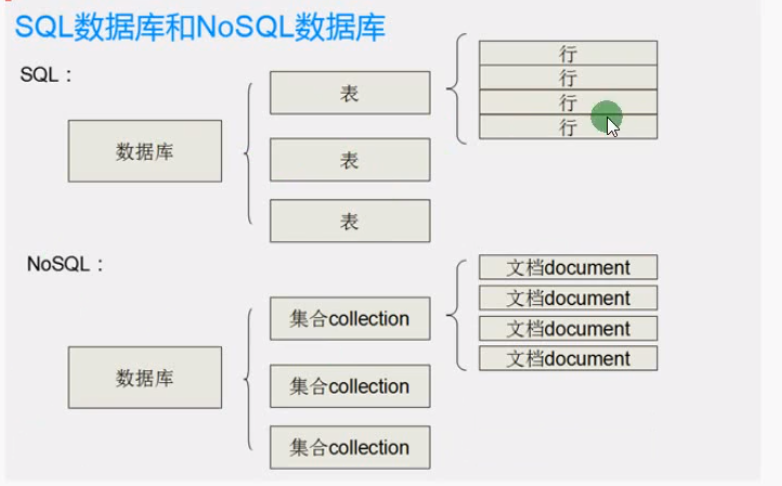

## Moogoose笔记
### 一、NoSql
#### 什么时候建议使用NoSql
1. 对数据库高并发读写的需求
2. 对海量数据的高效率存储和访问的需求
3. 对数据库的高可扩展性和高可用性的需求
#### NoSql和传统数据库简单对比
1. 非结构型数据库。没有行列的概念。用JSON来存储数据

#### NoSql数据库的四大分类
1. 键值存储数据库
2. 列存储数据库
3. 文档型数据库
4. 图形数据库

### 二、MongoDb
MongoDb是非关系型数据库中功能最丰富，最像关系型数据库的，几乎可以实现类似关系型数据库单表查询的绝大部分功能
#### MongoDb的安装与连接
网上资源多的是
#### 创建数据库
1. show dbs 命令可用于查看有哪些数据库
2. 创建数据库
   - use 数据库名
   - db.user.insert({"eee":"www"})  -- 插入一条数据后即可成功创建数据库
3. 查看数据库有哪些表： show collections
4. 创建表 
   - use 数据库名  -- 进入数据库
   - db.表名.insert({"eee":"www"})  -- 向表中插入一条数据即可成功创建表
5. 查看表中的内容
   - 查看所有记录：db.表名.find()
   - 