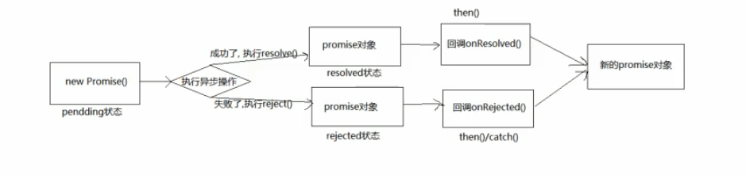
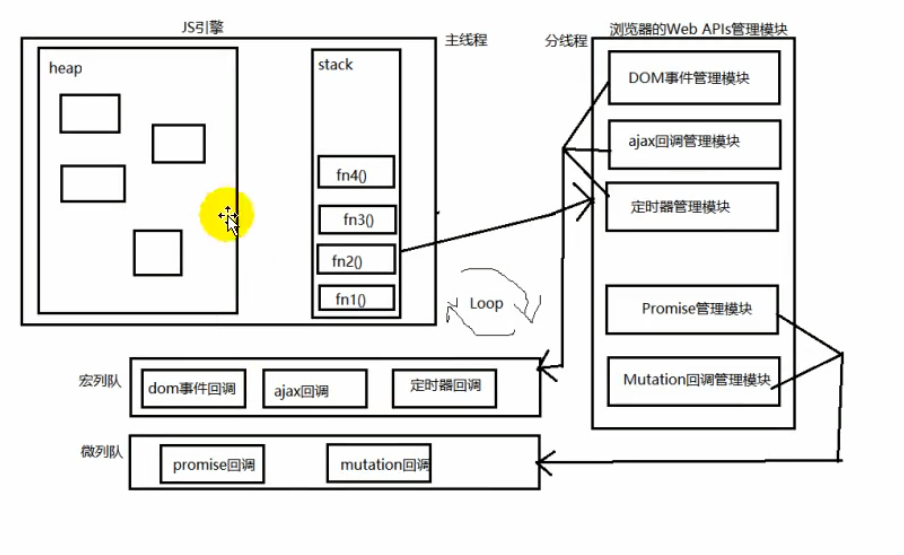

# Promise相关笔记 --- 尚硅谷promise
## 一、实例对象和函数对象
1. 函数对象：将函数作为对象使用时，简称为函数对象
2. 实例对象：new 函数产生的对象，简称对象
```javascript
<script type='text/javascript'>
    //js中所有函数都是Function类的实例
    function Fn () { //Fn函数

    }
    const fn = new Fn() //Fn是构造函数, fn是实例对象(简称为对象)
    console.log(Fn.prototype); //Fn是函数对象
    /**
     * bind()方法主要就是将函数绑定到某个对象，bind()会创建一个函数，函数体内的this对象的值会被绑定到传入bind()第一个参数的值，
     * 例如，f.bind(obj)，实际上可以理解为obj.f()，这时，f函数体内的this自然指向的是obj
    */
    Fn.bind({}) //Fn是函数对象
    $('#test') // (jQuery函数)  $是一个函数，根据选择器查找DOM元素 -- 括号的左边是函数
    $.get('/test') // (jQuery函数对象) 调用$函数对象的get方法 ---- 点的左边是对象
</script>
```
## 二、二种类型的回调函数
1. 什么是回调函数
   - 必须是自己定义的
   - 我不会亲自调用
   - 会自己执行
   - 例如setTimeout()中传递的回调函数
2. 回调函数的两种类型
   - 同步回调
      * 理解：立即执行，完全执行完了才结束，不会放入回调队列中
      * 例子：数组遍历相关的回调函数/ promise的excutor函数
   - 异步回调
      * 理解: 不会立即执行，会放入回调队列中将来执行
      * 例子：定时器回调 / ajax回调 / promise的成功|失败回调
```javascript
<script type='text/javascript'>
    /**
     * 1.同步回调函数
    */
    const arr = [1, 2, 3, 4, 5]
    arr.forEach(item => { //遍历回调，同步回调函数(就是说只有把forEach里面的回调函数执行完了，foreach才会结束)，不会放入队列
      console.log(item);
    })
    console.log('foreach()之后');
    /**
     * 2.异步回调函数
    */
    /**
     * js中两种定时器，setTimeout和setInterval的区别
     *     setTimeout只在指定时间后执行一次
     *     setInterval以指定时间为周期循环执行
    */
    setTimeout(() => { //异步回调函数，会放入队列中将来执行
      console.log('timeout callback()');
    }, 0)
    console.log('setTimeout()之后执行');
</script>
```
## 三、JS中的error处理
#### 错误的类型
   - Error错误：所有错误的父类型
   - ReferenceError: 引用的变量不存在
   - TypeError:数据类型不正确的错误
   - RangeError:数据值不在其所允许的范围内
   - SyntaxError:语法错误

```javascript
<script type='text/javascript'>
    /**
     * 常见的内置错误
    */
    //1.ReferenceError: 引用的变量不存在
    console.log(a);//Uncaught ReferenceError: a is not defined

    //2.TypeError:数据类型不正确的错误
    let b = null
    console.log(b.xxx);//Uncaught TypeError: Cannot read property 'xxx' of null

    //3.RangeError:数据值不在其所允许的范围内
    function fn () {
      fn()
    }
    fn() //Uncaught RangeError: Maximum call stack size exceeded

    //4.SyntaxError:语法错误
    const c = '''' //Uncaught SyntaxError: Unexpected string
</script>
```
#### 错误处理
   - 捕获错误：try ... catch ...
   - 抛出错误：throw error
#### 错误对象
   - message属性：错误相关信息
   - stack属性:函数调用栈记录信息
```javascript
<script>
  try{
      let b
      console.log(b.xxx);
    }catch(error){
      console.log(error.message);
      console.log(error.stack);
    }
    console.log('出错之后');
    //2.throw error
    function some () {
      if (Date.now()%2 === 0){
        console.log('当前时间为奇数，可以执行任务');
      } else {
        throw new Error('当前时间为偶数,无法执行')
      }
    }
    //捕获异常
    try {
      some()
    } catch (error) {
      alert(error.message)
    }
</script>
```
## 四、promise的理解和使用
#### promise是什么?
   - 抽象表达：promise是JS中进行异步编程的新的解决方案
   - 具体的表达
      + 从语法上来说，promise是一个构造函数
      + 从功能上来说，promise对象用来封装一个异步操作并可以获取其结果
   - promise的状态改变
      + pending变为resolved
      + pending变为rejected
      + 说明：只有这两种，且一个promise对象只能改变一次，无论变为成功还是失败，都会有一个结果数据，成功的结果数据一般称为value，失败的结果数据一般称为reason
#### promise的基本流程
   

#### promise的基本使用
```javascript
<script type='text/javascript'>
    // 1.创建一个新的promise对象
    const p = new Promise((resolve , reject) => { //执行器函数, 是一个同步回调
      console.log('执行 excutor')
      // 2.执行异步任务
      setTimeout(() => {
        const time = Date.now() //如果当前时间为偶数代表成功，否则失败
          // 3.1 如果成功了，调用resolve(value)
        if(time % 2 === 0){
          resolve('成功的数据，time =' + time)
        }else{
          //3.2 如果失败了，调用reject(reason)
          reject('失败的数据,time=' + time)
        }
      },1000)
    })
    console.log('new promise()执行之后')
    p.then(
      value => {//接受得到成功的value数据  onResolved
        console.log('成功的回调',value);
      },
      reason => {//接受得到失败的reason数据 onRejected
        console.log('失败的回调',reason);
      }
    )
</script>
```
#### **为什么要用promise?**(重点)
   - 指定回调函数的方式更加灵活
      + 旧的：必须在启动异步任务之前指定
      + promise: 启动异步任务 => 返回promise对象 => 给promise对象绑定回调函数(甚至可以在异步任务结束后指定)
   - 支持链式调用，可以解决回调地狱问题
      + 什么是回调地狱？回调函数嵌套调用，外部回调函数异步执行的结果是嵌套的回调函数执行的条件
      + 回调地狱的缺点？不便于阅读 / 不便于异常处理
      + 解决方案？ promise链式调用
      + 终极解决方案？ async/await
#### 如何使用promise
1. promise构造函数:Promise(excutor){}
   - excutor函数：执行器 (resolve,reject) => {}
   - resolve函数：内部定义成功时调用的函数 value => {}
   - reject函数：内部定义失败时我们调用的函数 reason => {}
   - 说明：excutor会在Promise内部立即同步回调，异步操作在执行器中执行
2. Promise.prototype.then方法：(onResolved , onRejected) => {}
   - onResolved函数：成功的回调函数 value => {}
   - onRejected函数：失败的回调函数 reason => {}
   - 说明：指定用于得到成功value的成功回调函数和用于得到失败reason的失败回调函数，返回一个新的promise对象
3. Promise.prototype.catch方法：(onRejected) => {}
   - onRejected函数：失败的回调函数 (reason) => {}
   - then的语法糖，相当于then(undefined,onRejected)
4. Promise.resolve方法：value => {}
   - value: 成功的数据或者promise对象
   - 说明：返回一个成功/失败的promise对象
5. Promise.reject方法：(reason) => {}
   - reason:失败的原因
   - 说明：返回一个失败的promise对象
6. Promise.all方法：(promises) => {}
   - promises:包含n个promise的数组
   - 说明：返回一个新的promise，只有所有的promise都成功才算成功，只要有一个失败了就直接失败
7. Promise.race方法：(promises) => {}
   - promises:包含n个promise数组
   - 说明：返回一个新的promise，第一个完成的promise的结果状态就是最终的状态
```javascript
<script type='text/javascript'>
    new Promise((resolve , reject) => {
      //执行异步任务
      setTimeout(() => {
        //resolve('成功的数据')
        reject('失败的数据')
      }, 1000)
    }).then(
      value => {
        console.log('onResolved()1', value);
      }
    ).catch(
      reason => {
        console.log('onRejected()1' , reason);
      }
    )
    // 产生一个成功值为1的promise对象
    const p1 = new Promise((resolve , reject) => {
      resolve(1)
    })
    
    const p2 = Promise.resolve(2)
    
    //产生一个失败值为3的promise对象
    const p3 = Promise.reject(3)
    p1.then( value => { console.log(value); })
    p2.then( value => { console.log(value); } )
    p3.catch( reason => { console.log(reason); })

    const pAll = Promise.all([p1 , p2])
    pAll.then(
      values => {
        console.log('all onResolved()',values);
      },
      reasons => {
        console.log('all onRejected()',reasons);
      }
    )

    const Prace = Promise.race([p3, p2, p1])
    Prace.then(
      value => {
        console.log('on Resolved()', value);
      },
      reason => {
        console.log('on Rejected()',reason);
      }
    )
</script>
```
## 五、Promise的关键问题？
#### 如何改变Promise状态
1. resolve(value):如果当前是pendding就会变为resolved
2. reject(reason):如果当前为pendding就会变为rejected
3. 抛出异常：如果当前为pendding就会变为rejected
#### 一个Promise指定多个成功/失败的回调函数，都会调用吗?
1. 当promise改变为对应状态时都会调用
```javascript
<script type='text/javascript'>
    const p = new Promise((resolve , reject) => {
      // resolve(1) //promise变为resolved成功状态
      // reject(2) // promise变为rejected失败状态
      // throw new Error('出错') //抛出异常，promise变为rejected失败状态，reason为抛出的error
      throw 3 //抛出异常，promise变为rejected失败状态，reason为抛出的3
    })
    p.then(
      value => {
        console.log('value1',value);
      },
      reason => {
        console.log('reason1', reason);
      }
    )
    p.then(
      value => {
        console.log('value2',value);
      },
      reason => {
        console.log('reason2',reason);
      }
    )
</script>
```
#### 改变promise状态和指定回调函数谁先谁后？
1. 都有可能，正常情况下是先指定回调再改变状态，但也可以先改变状态再指定回调
2. 如何先改变状态再指定回调？
   - 在执行器中直接调用resolve()/reject()
   - 延长更长时间才调用then()
3. 什么时候才能得到数据？
   - 如果先指定的回调，那当状态发送改变时，回调函数就会调用，得到数据
   - 如果先改变状态，那当指定回调时，回调函数就会调用，得到数据
```javascript
<script type='text/javascript'>
    // 常规上先指定回调，会改变状态
    new Promise((resolve , reject) => {
      setTimeout(() => {
        resolve(1) // 后改变的状态(同时指定数据),异步执行回调函数
      },1000)
    }).then( //先指定回调函数，保存当前指定的回调函数
      value => {},
      reason => {
        console.log('reason' , reason);
      }
    )

    new Promise((resolve , reject) => {
      resolve(1) // 先改变的状态(同时指定数据)
    }).then( //后指定回调函数，异步执行回调函数
      value => {},
      reason => {
        console.log('reason' , reason);
      }
    )
</script>
```
#### promise.then()返回的新的promise的结果状态由什么决定？
1. 简单表达式：有then()指定的回调函数执行的结果决定
2. 详细表达：
   - 如果抛出异常，新promise变为rejected，reason为抛出异常
   - 如果返回的是非promise任意值，新promise变为resolved,value为返回值
   - 如果返回的是另一个新的promise，此promise的结果就会成为新promise的结果
```javascript
<script type='text/javascript'>
    new Promise((resolve , reject) => {
      resolve(1)
    }).then(
      value => {
        console.log('value',value);//1
        //return value
        //return Promise.resolve(3)
        //return Promise.reject(4)
        // throw 5
      },
      reason => {
        console.log('reason',reason);
      }
    ).then(
      value => {
        console.log('value1',value);//undefined
      },
      reason => {
        console.log('reason1',reason);
      }
    )
</script>
```
#### promise如何串联多个操作任务？
1. promise的then返回一个新的promise，看一看成then的链式调用
2. 使用then的链式调用串联多个同步异步任务
```javascript
<script type='text/javascript'>
    new Promise((resolve , reject) => {
      setTimeout(() => {
        console.log('执行异步任务1');
        resolve(1)
      },1000)
    }).then(
      value => {
        console.log('任务1的结果',value);
        console.log('执行同步任务2');
        return 2
      }
    ).then(
      value => {
        console.log('同步任务2的结果',value);
        return new Promise((resolve , reject) => {
          //执行异步任务3
          setTimeout(() => {
            console.log('执行异步任务3');
            resolve(3)
          },1000)
        })
      }
    ).then(
      value => {
        console.log('异步任务3的结果');
      }
    )
</script>
```
#### promise异常穿透？
1. 当使用promise的then链式调用时，可以在最后指定失败的回调
2. 前面任何操作出现异常，都会传到最后失败的回调中处理
```javascript
<script type='text/javascript'>
    new Promise((resolve , reject) => {
      //resolve(1)
      reject(1)
    }).then(
      value => {
        console.log('onResolve()1',value);
        return 2
      },
      //异常穿透，相当于在每个then中 throw reason 或者 Promise.reject(reason)
      // reason => {
      //   throw reason
      // }
      // reason => {
      //   Promise.reject(reason)
      // }
    ).then(
      value => {
        console.log('onResolve()2',value);
        return 3
      }
    ).then(
      value => {
        console.log('onResolve()3',value);
      }
    ).catch(
      reason => {
        console.log('onRejected()1',reason);
      }
    )
</script>
```
#### 中断promise链？
1. 当使用promise的链式调用时，在中间中断，不再调用后面的回调函数
2. 办法：在回调函数中返回一个pendding状态的promise对象
```javascript
<script type='text/javascript'>
    new Promise((resolve , reject) => {
      reject(1)
    }).then(
      value => {
        console.log('onResolve()1',value);
        return 2
      }
    ).then(
      value => {
        console.log('onResolve()3',value);
      }
    ).catch(
      reason => {
        console.log('onRejected()1',reason);
        return new Promise(() => {})//返回一个pending的promise,中断promise链
      }
    ).then(
      value => {
        console.log('onResolve()4',value);
      },
      reason => {
        console.log('onRejected()2',reason);
      }
    )
</script>
```
## 六、自定义promise
增加了resolveDelay和rejectDelay两个方法，虽然有点鸡肋。。。
### 函数版本
```javascript
/**
 * 自定义promise函数模块,使用ES5语法
 */
//IIFE
(function (window) {

  const PENDING = 'pending'
  const RESOLVED = 'resolved'
  const REJECTED = 'rejected'
  /**
   * Promise构造函数
   * excutor:执行器函数(同步执行)
   */
  function Promise (excutor) {
    //将当前promise对象保存起来
    const self = this
    self.status = PENDING //给promise对象指定status，初始值为pending
    self.data = undefined // 给promise对象指定一个用于存储结果数据的属性
    self.callbacks = [] // 每个元素结构：{ onResolved() {}, onRejected() {}}
    function resolve (value) {
      // 如果当前状态不是pending,直接结束
      if (self.status !== PENDING) {
        return 
      }
      //将状态改为resolved
      self.status = RESOLVED
      //保存value数据
      self.data = value
      //如果有待执行的callbacks函数，立即异步执行回调函数onResolved
      if (self.callbacks.length > 0) {
        setTimeout(() => { //放入队列中执行所有成功的回调
          self.callbacks.forEach((callbacksObj) => {
            callbacksObj.onResolved(value)
          })
        })
      }
    }
    function reject (reason) {
      // 如果当前状态不是pending,直接结束
      if (self.status !== PENDING) {
        return 
      }
      //将状态改为rejected
      self.status = REJECTED
      //保存reason数据
      self.data = reason
      //如果有待执行的callbacks函数，立即异步执行回调函数onRejected
      if (self.callbacks.length > 0) {
        setTimeout(() => { //放入队列中执行所有成功的回调
          self.callbacks.forEach((callbacksObj) => {
            callbacksObj.onRejected(reason)
          })
        })
      }
    }
    //立即同步执行excutor
    try {
      excutor(resolve , reject)
    }catch (error) { //如果执行器抛出异常，promise对象变为rejected
      reject(error)
    }
    
  }
  //promise原型对象的then():指定成功和失败的回调函数，返回一个新的promise对象
  Promise.prototype.then = function (onResolved , onRejected) {
    onResolved = typeof onResolved === 'function' ? onResolved : value => value //向后传递成功的value

    //指定默认的失败回调(实现错误/异常穿透的关键步骤)
    onRejected = typeof onRejected === 'function' ? onRejected : reason => { throw reason } //向后传递失败的reason

    const self = this

    //返回一个新的promise对象
    return new Promise((resolve , reject) => {
      //调用指定的回调函数处理，根据执行的结果改变return的promise状态
      function handle (callback) {
        try {
          const result = callback(self.data)
          if (result instanceof Promise) {
            /*如果回调函数返回promise，return的promise结果就是这个promise的结果*/
            // result.then(
            //     value  =>  resolve(value), //当result成功时，让return的promise也成功
            //     reason =>  reject(reason) //当result失败时，让return的promise也失败
            // )
            //简洁写法
            result.then(resolve , reject)
          } else {
            /*如果回调函数返回的不是promise，return的promise就会成功，value就是返回的值*/
            resolve(result)
          }
        } catch (error) {
          reject(error)
        }
      }
      if (self.status === PENDING) {
        //当前状态是pending状态,将回调函数保存起来
        self.callbacks.push({
          onResolved () {
            handle(onResolved)
          },
          onRejected () {
            handle(onRejected)
          }
        })
      } else if (self.status === RESOLVED) { //如果当前是resolved状态，异步执行onResolved并改变return的promise状态
        setTimeout(() => {
          handle(onResolved)
        })
      } else { //如果当前是rejected状态，异步执行onRejected并改变return的promise状态
        setTimeout(() => {
          handle(onRejected)
        })
      }
    })
  }
  //promise原型对象的catch()：指定失败的回调函数，返回一个新的promise
  Promise.prototype.catch = function (onRejected) {
    return this.then(undefined , onRejected)
  }
  /**
   * Promise函数方法
   *   resolve：返回一个指定结果的成功的promise
   *   reject：返回一个指定的reason的失败的promise
   *   all：返回一个promise，只有当所有promise都成功时才算成功，否则失败
   *   race：返回一个promise，其结果由第一个完成的promise决定
   */
  Promise.resolve = function (value) {
    //返回一个成功/失败的promise
    return new Promise((resolve , reject) => {
      // value是promise
      if (value instanceof Promise) { //使用value的结果作为当前promise结果
        value.then(resolve , reject)
      } else {
        // value不是promise
        resolve(value)
      }
    })
  }
  Promise.reject = function (reason) {
    // 返回一个失败的promise
    return new Promise((resolve , reject) => {
      reject(reason)
    })
  }
  Promise.all = function (promises) {
    //用来保存  所有成功value的数组
    const values = new Array(promises.length)
    //用来保存成功promise的数量
    let resolveCount = 0
    //返回一个新的promise  
    return new Promise((resolve , reject) => {
      //遍历获取每个promise结果
      promises.forEach((p , index) => {
        Promise.resolve(p).then(
          value => {
            resolveCount++
            //p成功，将成功的value保存到values中
            values[index] = value
            //如果全部成功，将return的promise改为成功
            if (resolveCount === promises.length) {
              resolve(values)
            }
          },
          reason => { //只要有一个失败了，所有都失败
            reject(reason)
          }
        )
      })
    })
  }
  Promise.race = function (promises) {
    //返回一个新的promise
    return new Promise((resolve, reject) => {
      //遍历获取每个promise结果
      promises.forEach((p , index) => {
        Promise.resolve(p).then(
          value => { //一旦有成功的，将return变为成功
            resolve(value)
          },
          reason => { //只要有一个失败了，所有都失败
            reject(reason)
          }
        )
      })
    })
  }
  /**
   * 返回一个promise对象，在指定的时间后确定结果
   */
  Promise.resolveDelay = function (value, time) {
     //返回一个成功/失败的promise
     return new Promise((resolve , reject) => {
      setTimeout(() => {
        // value是promise
        if (value instanceof Promise) { //使用value的结果作为当前promise结果
          value.then(resolve , reject)
        } else {
          // value不是promise
          resolve(value)
        }
      },time)
    })
  }
  /**
   * 返回一个promise对象，在指定的时间之后失败
   */
  Promise.rejectDelay = function (reason, time) {
     // 返回一个失败的promise
     return new Promise((resolve , reject) => {
      setTimeout(() => {
        reject(reason)
      })
    })
  }
  //向外暴露promise函数
  window.Promise = Promise
})(window)
```
### class版本
```javascript
/**
 * 自定义promise函数模块,使用ES5语法
 */
//IIFE
(function (window) {

  const PENDING = 'pending'
  const RESOLVED = 'resolved'
  const REJECTED = 'rejected'

  class Promise {
    constructor (excutor) {
        //将当前promise对象保存起来
      const self = this
      self.status = PENDING //给promise对象指定status，初始值为pending
      self.data = undefined // 给promise对象指定一个用于存储结果数据的属性
      self.callbacks = [] // 每个元素结构：{ onResolved() {}, onRejected() {}}
      function resolve (value) {
        // 如果当前状态不是pending,直接结束
        if (self.status !== PENDING) {
          return 
        }
        //将状态改为resolved
        self.status = RESOLVED
        //保存value数据
        self.data = value
        //如果有待执行的callbacks函数，立即异步执行回调函数onResolved
        if (self.callbacks.length > 0) {
          setTimeout(() => { //放入队列中执行所有成功的回调
            self.callbacks.forEach((callbacksObj) => {
              callbacksObj.onResolved(value)
            })
          })
        }
      }
      function reject (reason) {
        // 如果当前状态不是pending,直接结束
        if (self.status !== PENDING) {
          return 
        }
        //将状态改为rejected
        self.status = REJECTED
        //保存reason数据
        self.data = reason
        //如果有待执行的callbacks函数，立即异步执行回调函数onRejected
        if (self.callbacks.length > 0) {
          setTimeout(() => { //放入队列中执行所有成功的回调
            self.callbacks.forEach((callbacksObj) => {
              callbacksObj.onRejected(reason)
            })
          })
        }
      }
      //立即同步执行excutor
      try {
        excutor(resolve , reject)
      }catch (error) { //如果执行器抛出异常，promise对象变为rejected
        reject(error)
      } 
    }
    //promise原型对象的then():指定成功和失败的回调函数，返回一个新的promise对象
    then (onResolved , onRejected) {
      onResolved = typeof onResolved === 'function' ? onResolved : value => value //向后传递成功的value

      //指定默认的失败回调(实现错误/异常穿透的关键步骤)
      onRejected = typeof onRejected === 'function' ? onRejected : reason => { throw reason } //向后传递失败的reason

      const self = this

      //返回一个新的promise对象
      return new Promise((resolve , reject) => {
        //调用指定的回调函数处理，根据执行的结果改变return的promise状态
        function handle (callback) {
          try {
            const result = callback(self.data)
            if (result instanceof Promise) {
              /*如果回调函数返回promise，return的promise结果就是这个promise的结果*/
              // result.then(
              //     value  =>  resolve(value), //当result成功时，让return的promise也成功
              //     reason =>  reject(reason) //当result失败时，让return的promise也失败
              // )
              //简洁写法
              result.then(resolve , reject)
            } else {
              /*如果回调函数返回的不是promise，return的promise就会成功，value就是返回的值*/
              resolve(result)
            }
          } catch (error) {
            reject(error)
          }
        }
        if (self.status === PENDING) {
          //当前状态是pending状态,将回调函数保存起来
          self.callbacks.push({
            onResolved () {
              handle(onResolved)
            },
            onRejected () {
              handle(onRejected)
            }
          })
        } else if (self.status === RESOLVED) { //如果当前是resolved状态，异步执行onResolved并改变return的promise状态
          setTimeout(() => {
            handle(onResolved)
          })
        } else { //如果当前是rejected状态，异步执行onRejected并改变return的promise状态
          setTimeout(() => {
            handle(onRejected)
          })
        }
      })
    }
    //promise原型对象的catch()：指定失败的回调函数，返回一个新的promise
    catch (onRejected) {
      return this.then(undefined , onRejected)
    }
    /**
   * Promise函数方法
   *   resolve：返回一个指定结果的成功的promise
   *   reject：返回一个指定的reason的失败的promise
   *   all：返回一个promise，只有当所有promise都成功时才算成功，否则失败
   *   race：返回一个promise，其结果由第一个完成的promise决定
   */
    static resolve = function (value) {
      //返回一个成功/失败的promise
      return new Promise((resolve , reject) => {
        // value是promise
        if (value instanceof Promise) { //使用value的结果作为当前promise结果
          value.then(resolve , reject)
        } else {
          // value不是promise
          resolve(value)
        }
    })
    }
    static reject = function (reason) {
      // 返回一个失败的promise
      return new Promise((resolve , reject) => {
        reject(reason)
      })
    }
    static all = function (promises) {
      //用来保存  所有成功value的数组
      const values = new Array(promises.length)
      //用来保存成功promise的数量
      let resolveCount = 0
      //返回一个新的promise  
      return new Promise((resolve , reject) => {
        //遍历获取每个promise结果
        promises.forEach((p , index) => {
          Promise.resolve(p).then(
            value => {
              resolveCount++
              //p成功，将成功的value保存到values中
              values[index] = value
              //如果全部成功，将return的promise改为成功
              if (resolveCount === promises.length) {
                resolve(values)
              }
            },
            reason => { //只要有一个失败了，所有都失败
              reject(reason)
            }
          )
        })
      })
    }
    static race = function (promises) {
      //返回一个新的promise
      return new Promise((resolve, reject) => {
        //遍历获取每个promise结果
        promises.forEach((p , index) => {
          Promise.resolve(p).then(
            value => { //一旦有成功的，将return变为成功
              resolve(value)
            },
            reason => { //只要有一个失败了，所有都失败
              reject(reason)
            }
          )
        })
      })
    }
    /**
     * 返回一个promise对象，在指定的时间后确定结果
     */
    static resolveDelay = function (value, time) {
      //返回一个成功/失败的promise
      return new Promise((resolve , reject) => {
        setTimeout(() => {
          // value是promise
          if (value instanceof Promise) { //使用value的结果作为当前promise结果
            value.then(resolve , reject)
          } else {
            // value不是promise
            resolve(value)
          }
        },time)
      })
    }
    /**
     * 返回一个promise对象，在指定的时间之后失败
     */
    static rejectDelay = function (reason, time) {
      // 返回一个失败的promise
      return new Promise((resolve , reject) => {
        setTimeout(() => {
          reject(reason)
        })
      })
    }
  }
  //向外暴露promise函数
  window.Promise = Promise
})(window)
```
## 七、async和awiat
1. async 函数
   - 函数的返回值为promise对象
   - promise对象的结果由async函数执行的返回值决定
2. await表达式
   - await右侧的表达式一般为promise对象，但也可以是其他值
   - 如果表达式是promise对象，await返回的都是promise的成功值
   - 如果表达式是其他值，直接将此值作为await返回值
3. 注意
   - await必须写在async函数中，但async函数中可以没有await
   - 如果await的promise失败了，就会抛出异常，需要通过try ... catch来捕获处理
## 八、JS异步之宏队列和微队列


#### 说明
1. JS中用来存储待执行回调函数的队列包含两个不同特定的队列
2. 宏队列：用来保存待执行的宏任务(回调),比如：定时器回调/DOM事件回调/Ajax回调
3. 微队列：用来保存待执行的微任务(回调)，比如：promise的回调/mutationObserver()的回调
4. JS执行时会区别这两个队列
   - JS引擎首先必须执行所有的初始化同步代码
   - 每次准备取出第一个宏任务执行前，都要将所有的微任务一个一个取出来执行

## 面试题
### 面试题一
```javascript
<script type='text/javascript'>
    /**
     * 输出结果依次为：3,2,4,1
    */
    setTimeout(() => { //宏队列执行
      console.log(1);
    },0)
    Promise.resolve().then( //微队列执行
      value => {
        console.log(2);
      }
    )
    Promise.resolve().then( //微队列执行
      value => {
        console.log(4);
      }
    )
    console.log(3);
</script>
```
### 面试题二
```javascript
<script type='text/javascript'>
    /**
     * 首先 -- 先执行同步的，即2,5输出
     * 其次 -- 将1放入宏队列，将3放入微队列，由于此时3的状态还是pending，没有发生状态改变，所以先不会将4放入微队列
     * 接着 -- 3执行，状态改变，4放入微队列
     * 输出结果为：2,5,3,4,1
    */
    setTimeout(() => {
      console.log(1);
    },0)
    new Promise((resolve, reject) => {
      console.log(2);
      resolve()
    }).then(
      () => {
        console.log(3);
      }
    ).then(() => {
      console.log(4);
    })
    console.log(5);
</script>
```
### 面试题三
```javascript
<script type='text/javascript'>
    /**
     * 同步 -- 3,7,4
     * 宏队列：5
     * 微队列：先放1，后放2，1先出队列，2后出队列
    */
    const first = () => (
      new Promise((resolve, reject) => {
        console.log(3);
        let p = new Promise((resolve, reject) => {
          console.log(7);
          setTimeout(() => {
            console.log(5);
            resolve(6)//执行这行代码时，p的状态已经改变
          },0)
          resolve(1)
        })
        resolve(2)
        p.then(
          (arg) => {
            console.log(arg);
          }
        )
      })
    )
    first().then(
      (arg) => {
        console.log(arg);
      }
    )
    console.log(4);
</script>
```
### 面试题四
```javascript
<script type='text/javascript'>
    /**
     * 同步 --> 微队列中没有之后才会输出宏队列中的值
     * 输出结果：1，7，2，3，8，4,6，5，0
     * 同步：1，7
     * 宏：0, 
     * 微：首先 -- 2，8
     *     其次 -- 输出2，取出输出为2的回调函数执行，3立即输出
     *     接着 -- 微队列[8,4，6],4和6加入微队列
     *     然后 -- 8出微队列
     *     再然后 -- 4出微队列，5加入微队列，微队列值为[6,5],
     *     最后 -- 6出微队列，5出微队列
     * 
    */
    setTimeout(() => {
      console.log('0');
    },0)

    new Promise((resolve, reject) => {
      console.log('1');
      resolve()
    }).then(() => {
      console.log('2');
      new Promise((resolve, reject) => {
        console.log('3');
        resolve()
      }).then(() => {
        console.log('4');
      }).then(() => {
        console.log('5');
      })
    }).then(() => {
      console.log('6');
    })
    new Promise((resolve, reject) => {
      console.log('7');
      resolve()
    }).then(() => {
      console.log('8');
    })
</script>
```
### 面试题五
手写/自定义promise