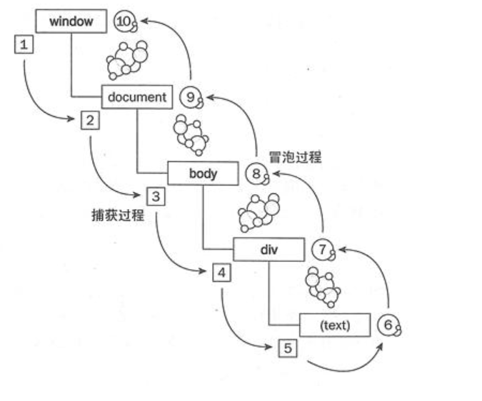

## JS知识点总结
### BOM
BOM 是 browser object model 的缩写， 简称浏览器对象模型。 主要处理浏览器窗口和框架， 描述了与浏览器进行交互的方法和接口， 可以对浏览器窗口进行访问和操作， 譬如可以弹出 新的窗口， 回退历史记录， 获取 url等
#### BOM 与 DOM 的关系
1. javacsript是通过访问BOM对象来访问、控制、修改浏览器
2. BOM的window包含了document,因此通过window对象的document属性就可以访问、检索、修改文档内容与结构。
3. document 对象又是 DOM 模型的根节点。
4. 因此,BOM包含了DOM，浏览器提供出来给予访问的是 BOM 对象，从BOM对象再访问到DOM对象，从而js可以操作浏览器以及浏览器读取到的文档
#### BOM 对象包含哪些内容？
1. Window JavaScript 层级中的顶层对象,表示浏览器窗口。
2. Navigator 包含客户端浏览器的信息。
3. History 包含了浏览器窗口访问过的 URL。
4. Location 包含了当前 URL 的信息。
5. Screen 包含客户端显示屏的信息。
#### History 对象
1. History 对象包含用户(在浏览器窗口中)访问过的URL

| 方法/属性 |    描述    |
|   :----: |    :----:  |
| length   | 返回浏览器历史列表中的 URL 数量。 |
| back()   | 加载 history 列表中的前一个 URL  |
|forward() | 加载 history 列表中的下一个 URL  |
| go()     | 加载 history 列表中的某个具体页面 |

#### Location 对象
Location 对象包含有关当前 URL 的信息。

|  属性   |    描述    |
| :----:  |  :----:    |
|  hash   | 设置或返回从井号 (#) 开始的 URL（锚）|
|  host   | 设置或返回主机名和当前 URL 的端口号 |
| hostname |	设置或返回当前 URL 的主机名。 |
| href	| 设置或返回完整的 URL。 |
| pathname	| 设置或返回当前 URL 的路径部分。 |
| port	| 设置或返回当前 URL 的端口号。 |
| protocol |	设置或返回当前 URL 的协议。|
| search	| 置或返回从问号 (?) 开始的 URL(查询部分) | 
--------------------------------------------------------
|  方法  |   描述  |
| :----: | :----:  |
| assign()	| 加载新的文档。 |
| reload(‘force’)	| 重新加载当前文档。参数可选，不填或填 false 则取浏览器缓存的文档 |
| replace()	| 用新的文档替换当前文档。|

#### Window 对象
Window对象表示一个浏览器窗口或一个框架。 在客户端 JavaScript中, Window 对象 是全局对象，所有的表达式都在当前的环境中计算。例如，可以只写document,而不必写window.document。

|属性 |	描述 |
| :---- | :----: |
| closed	| 返回窗口是否已被关闭。|
| defaultStatus | 	设置或返回窗口状态栏中的默认文本(仅Opera支持) |
| document	| 对Document对象的只读引用 请参阅 Document 对象。|
| history |	对 History 对象的只读引用。 请参数 History 对象。|
| innerheight	| 返回窗口的文档显示区的高度。|
| innerwidth |	返回窗口的文档显示区的宽度。|
| length	| 设置或返回窗口中的框架数量。|
| location |	用于窗口或框架的 Location 对象。 请参阅 Location 对象。|
| name |	设置或返回窗口的名称。|
| Navigator |	对 Navigator 对象的只读引用。 请参数 Navigator 对象。|
| opener	| 返回对创建此窗口的窗口的引用。|
| outerheight	| 返回窗口的外部高度。|
| outerwidth	| 返回窗口的外部宽度。|
| pageXOffset |	设置或返回当前页面相对于窗口显示区左上角的 X 位置。|
| pageYOffset	| 设置或返回当前页面相对于窗口显示区左上角的 Y 位置。|
| parent | 返回父窗口。|
| Screen	| 对 Screen 对象的只读引用。 请参数 Screen 对象。|
| self	| 返回对当前窗口的引用。 等价于 Window 属性。|
| status	| 设置窗口状态栏的文本。 (默认只支持 Opera)|
| top	| 返回最顶层的先辈窗口。|
| window	| window 属性等价于 self 属性， 它包含了对窗口自身的引用。|
| screenLeft/screenTop/screenX/screenY	| 只读整数。声明了窗口的左上角在屏幕上的的 x 坐标和 y 坐标。 IE、 Safari、 Chrome 和 Opera 支持 screenLeft 和 screenTop， 而 Chrome、 Firefox 和 Safari 支持 screenX 和 screenY。|
------------------------------------------------------------------------------------
| 方法	| 描述 |
| :----: | :----: |
| alert()	| 显示带有一段消息和一个确认按钮的警告框。|
| blur() |	把键盘焦点从顶层窗口移开。|
| confirm() |	显示带有一段消息以及确认按钮和取消按钮的对话框。|
| createPopup()	| 创建一个弹出窗口。 只有 ie 支持（不包括 ie11）|
| focus()	| 把键盘焦点给予一个窗口。|
| moveBy() |	可相对窗口的当前坐标把它移动指定的像素。|
| moveTo() |	把窗口的左上角移动到一个指定的坐标。|
| open()	| 打开一个新的浏览器窗口或查找一个已命名的窗口。 window.open(URL,name,features,replace)|
| print()	| 打印当前窗口的内容。|
| prompt() |	显示可提示用户输入的对话框。|
| resizeBy() |	按照指定的像素调整窗口的大小。|
| resizeTo()	| 把窗口的大小调整到指定的宽度和高度。|
| scrollBy()	| 按照指定的像素值来滚动内容。|
| scrollTo()	| 把内容滚动到指定的坐标。|
| setInterval()	| 按照指定的周期（以毫秒计） 来调用函数或计算表达式。|
| setTimeout()	| 在指定的毫秒数后调用函数或计算表达式。|
| clearInterval()	| 取消由 setInterval() 设置的 timeout。|
| clearTimeout() | 	取消由 setTimeout() 方法设置的 timeout。close() 关闭浏览器窗口|

#### Navigator 对象
Navigator 对象包含的属性描述了正在使用的浏览器。 可以使用这些属性进行平台专用的配置。 虽然这个对象的名称显而易见的是 Netscape 的 Navigator 浏览器， 但其他实现了 JavaScript 的浏览器也支持这个对象。

| 属性	| 描述 |
| :----: | :----: |
| appCodeName |	返回浏览器的代码名。 以 Netscape 代码为基础的浏览器中， 它的值是 "Mozilla"。Microsoft 也是|
| appMinorVersion	| 返回浏览器的次级版本。 （IE4、 Opera 支持）|
| appName	| 返回浏览器的名称。|
| appVersion	| 返回浏览器的平台和版本信息。|
| browserLanguage	| 返回当前浏览器的语言。 （IE 和 Opera 支持）cookieEnabled 返回指明浏览器中是否启用 cookie 的布尔值。|
| cpuClass |	返回浏览器系统的 CPU 等级。 （IE 支持）|
| onLine	| 返回指明系统是否处于脱机模式的布尔值。|
platform	| 返回运行浏览器的操作系统平台。|
systemLanguage	| 返回当前操作系统的默认语言。 （IE 支持）|
userAgent	| 返回由客户机发送服务器的 user-agent 头部的值。|
userLanguage	| 返回操作系统设定的自然语言。 （IE 和 Opera 支持）|
| plugins	| 返回包含客户端安装的所有插件的数组 |
------------------------------------------------------------------------------
| 方法 | 描述 |
| :----: | :----: |
| javaEnabled()	| 规定浏览器是否支持并启用了 Java。|
| taintEnabled() | 	规定浏览器是否启用数据污点 (data tainting)。|

#### Screen 对象
Screen 对象包含有关客户端显示屏幕的信息。 每个 Window 对象的 screen 属性都引用一个 Screen 对象。 Screen 对象中存放着有关显示浏览器屏幕的信息。 JavaScript 程序将利用这些信息来优化它们的输出， 以达到用户的显示要求。 例如，一个程序可以根据显示器的尺寸选择使用大图像还是使用小图像，它还可以根据显示器的颜色深度选择使用 16 位色还是使用 8 位色的图形。 另外，JavaScript 程序还能根有关屏幕尺寸的信息将新的浏览器窗口定位在屏幕中间。

| 属性	| 描述 |
| :----: | :----: |
| availHeight	| 返回显示屏幕的高度 (除 Windows 任务栏之外)。|
| availWidth | 	返回显示屏幕的宽度 (除 Windows 任务栏之外)。|
| bufferDepth	| 设置或返回调色板的比特深度。 （仅 IE 支持）colorDepth 返回目标设备或缓冲器上的调色板的比特深度。|
| deviceXDPI	| 返回显示屏幕的每英寸水平点数。 （仅 IE 支持）|
| deviceYDPI	| 返回显示屏幕的每英寸垂直点数。 （仅 IE 支持）|
| fontSmoothingEnabled	| 返回用户是否在显示控制面板中启用了字体平滑。 （仅 IE 支持）|
| height	| 返回显示屏幕的高度。|
| logicalXDPI	| 返回显示屏幕每英寸的水平方向的常规点数。(仅 IE 支持)|
| logicalYDPI	| 返回显示屏幕每英寸的垂直方向的常规点数。(仅 IE 支持)|
| pixelDepth	| 返回显示屏幕的颜色分辨率(比特每像素)|
| updateInterval	|设置或返回屏幕的刷新率。 (仅 IE11 以下支持)|
| width	| 返回显示器屏幕的宽度。|

#### 检测浏览器版本版本有哪些方式？
1. 根据 navigator.userAgent // UA.toLowerCase().indexOf('chrome')
2. 根据 window 对象的成员 // 'ActiveXObject' in window
#### offsetWidth/offsetHeight,clientWidth/clientHeight 与 scrollWidth/scrollHeight 的区别
1. offsetWidth/offsetHeight 返回值包含 content + padding + border，效果与 e.getBoundingClientRect()相同
2. clientWidth/clientHeight 返回值只包含 content + padding，如果有滚动条，也不包含滚动条
3. scrollWidth/scrollHeight 返回值包含 content + padding + 溢出内容的尺寸
### DOM
#### [DOM操作](https://blog.csdn.net/Night_Emperor/article/details/78471051)
#### DOM事件级别
1. DOM0
   - onXXX类型的定义事件
   - element.onclick = function(e) { ... }
2. DOM2
   - addEventListener方式
   - element.addEventListener('click', function (e) { ... })
   - btn.removeEventListener('click', func, false)
   - btn.attachEvent("onclick", func);
   - btn.detachEvent("onclick", func);
3. DOM3
   - 增加了很多事件类型
   - element.addEventListener('keyup', function (e) { ... })
   - eventUtil 是自定义对象，textInput 是 DOM3 级事件
#### DOM事件模型



捕获从上到下，冒泡从下到上，先捕获，再到目标，再冒泡

#### DOM事件流
1. DOM标准采用捕获+冒泡。两种事件流都会触发DOM的所有对象，从window对象开始，也在window对象结束。
2. DOM标准规定事件流包括三个阶段：
   - 事件捕获阶段
   - 处于目标阶段
   - 事件冒泡阶段
#### 描述DOM事件捕获的具体流程
从window -> document -> html -> body -> ... -> 目标元素
#### Event对象常见应用
1. event.target
   - 触发事件的元素
2. event.currentTarget
   - 绑定事件的元素
3. event.preventDefault()
   - 阻止默认行为
   - event.cancelBubble()和event.preventBubble 都已经废弃
4. event.stopPropagation()
   - 阻止在捕获阶段或冒泡阶段继续传播，而不是阻止冒泡
5. event.stopImmediatePropagation()
   - 阻止事件冒泡并且阻止相同事件的其他侦听器被调用。
#### 事件的代理/委托
事件委托是指将事件绑定目标元素的到父元素上，利用冒泡机制触发该事件
1. 优点：
   - 可以减少事件注册，节省大量内存占用
   - 可以将事件应用于动态添加的子元素上
2. 但使用不当会造成事件在不应该触发时触发
```javascript
ulEl.addEventListener('click', function(e){
  var target = event.target || event.srcElement;
  if(target && target.nodeName.toUpperCase() === "LI"){
    console.log(target.innerHTML);
  }
}, false);
```
#### 自定义事件
1. Event
2. CustomEvent
3. CustomEvent不仅可以用来做自定义事件，还可以在后面跟一个object做参数
```javascript
var evt = new Event('myEvent');
someDom.addEventListener('myEvent', function() {
  //处理这个自定义事件
});
someDom.dispatchEvent(evt);
```
#### IE与火狐的事件机制有什么区别？如何阻止冒泡？
IE 只事件冒泡，不支持事件捕获；火狐同时支持件冒泡和事件捕获。
1. 阻止冒泡：
   - 取消默认操作
      * w3c 的方法是 e.preventDefault()
      * IE 则是使用 e.returnValue = false;
   - return false
      * javascript 的 return false 只会阻止默认行为
      * 是用 jQuery 的话则既阻止默认行为又防止对象冒泡。
   - 阻止冒泡
      * w3c 的方法是 e.stopPropagation()
      * IE 则是使用 e.cancelBubble = true
```javascript
[js] view plaincopy
function stopHandler(event)
  window.event 
  ? window.event.cancelBubble = true 
  : event.stopPropagation();
}
```
#### DOM 元素的 dom.getAttribute(propName)和 dom.propName 有什么区别和联系
1. dom.getAttribute()，是标准 DOM 操作文档元素属性的方法，具有通用性可在任意文档上使用，返回元素在源文件中设置的属性
2. dom.propName 通常是在 HTML 文档中访问特定元素的特性，浏览器解析元素后生成对应对象（如 a 标签生成 HTMLAnchorElement），这些对象的特性会根据特定规则结合属性设置得到，对于没有对应特性的属性，只能使用 getAttribute 进行访问
3. dom.getAttribute()返回值是源文件中设置的值，类型是字符串或者 null（有的实现返回""）
4. dom.propName 返回值可能是字符串、布尔值、对象、undefined 等
5. 大部分 attribute 与 property 是一一对应关系，修改其中一个会影响另一个，如 id，title 等属性
6. 一些布尔属性<input hidden/>的检测设置需要 hasAttribute 和 removeAttribute 来完成，或者设置对应 property
7. 像<a href="../index.html">link</a>中 href 属性，转换成 property 的时候需要通过转换得到完整 URL
8. 一些 attribute 和 property 不是一一对应如：form 控件中<input value="hello"/>对应的是 defaultValue，修改或设置 value property 修改的是控件当前值，setAttribute 修改 value 属性不会改变 value property
#### JS获取dom的CSS样式
```javascript
function getStyle(obj, attr){
  if(obj.currentStyle){
    return obj.currentStyle[attr];
  } else {
    return window.getComputedStyle(obj, false)[attr];
  }
}
```
#### [JS实现鼠标拖拽](https://blog.csdn.net/qq_37746973/article/details/80748879)
#### DOM 操作——怎样添加、移除、移动、复制、创建和查找节点?
1. 创建新节点
   - createDocumentFragment() //创建一个 DOM 片段
   - createElement() //创建一个具体的元素
   - createTextNode() //创建一个文本节点
2. 添加、移除、替换、插入
   - appendChild()
   - removeChild()
   - replaceChild()
   - insertBefore() //在已有的子节点前插入一个新的子节点
3. 查找
   - getElementsByTagName() //通过标签名称
   - getElementsByName() // 通过元素的 Name 属性的值(IE 容错能力较强，会得到一个数组，其中包括 id 等于 name 值的)
   - getElementById() //通过元素 Id，唯一性
#### documen.write 和 innerHTML 的区别
1. document.write 只能重绘整个页面
2. innerHTML 可以重绘页面的一部分
#### Window 对象 与 document对象
1. window
   - Window 对象表示当前浏览器的窗口，是 JavaScript 的顶级对象。
   - 我们创建的所有对象、函数、变量都是 Window 对象的成员。
   - Window 对象的方法和属性是在全局范围内有效的。
2. document
   - Document 对象是 HTML 文档的根节点与所有其他节点（元素节点，文本节点，属性节点, 注释节点）
   - Document 对象使我们可以通过脚本对 HTML 页面中的所有元素进行访问
   - Document 对象是 Window 对象的一部分，即 window.document
#### 区分什么是“客户区坐标”、“页面坐标”、“屏幕坐标”
1. 客户区坐标
   - 鼠标指针在可视区中的水平坐标(clientX)和垂直坐标(clientY)
2. 页面坐标
   - 鼠标指针在页面布局中的水平坐标(pageX)和垂直坐标
3. 屏幕坐标
   - 设备物理屏幕的水平坐标(screenX)和垂直坐标(screenY)
#### focus/blur与focusin/focusout的区别与联系
1. focus/blur不冒泡，focusin/focusout冒泡
2. focus/blur兼容性好，focusin/focusout在除FireFox外的浏览器下都保持良好兼容性，如需使用事件托管，可考虑在FireFox下使用事件捕获elem.addEventListener('focus', handler, true)
#### mouseover/mouseout与mouseenter/mouseleave的区别与联系
1. mouseover/mouseout是标准事件，所有浏览器都支持；mouseenter/mouseleave是IE5.5引入的特有事件后来被DOM3标准采纳，现代标准浏览器也支持
2. mouseover/mouseout是冒泡事件；mouseenter/mouseleave不冒泡。需要为多个元素监听鼠标移入/出事件时，推荐mouseover/mouseout托管，提高性能
3. 标准事件模型中event.target表示发生移入/出的元素,vent.relatedTarget对应移出/如元素；在老IE中event.srcElement表示发生移入/出的元素，event.toElement表示移出的目标元素，event.fromElement表示移入时的来源元素
#### IE 的事件处理和 W3C 的事件处理有哪些区别？
1. 绑定事件
   - W3C: targetEl.addEventListener('click', handler, false);
   - IE: targetEl.attachEvent('onclick', handler);
2. 删除事件
   - W3C: targetEl.removeEventListener('click', handler, false);
   - IE: targetEl.detachEvent(event, handler);
3. 事件对象 
   - W3C: var e = arguments.callee.caller.arguments[0]
   - IE: window.event
4. 事件目标
   - W3C: e.target
   - IE: window.event.srcElement
5. 阻止事件默认行为
   - W3C: e.preventDefault()
   - IE: window.event.returnValue = false'
6. 阻止事件传播
   - W3C: e.stopPropagation()
   - IE: window.event.cancelBubble = true
### JS变量类型和类型转换
#### JS 变量类型
1. JS中有 6 种原始值，分别是：
   - boolean
   - number
   - string
   - undefined
   - symbol
   - null
2. 引用类型：
   - 对象
   - 数组
   - 函数
#### JS中使用typeof能得到哪些类型？
1. 其中一个奇怪的 null，虽然是基本变量，但是因为设计的时候null是全0，而对象是000开头，所以有这个误判。
2. boolean
3. number
4. string
5. undefined
6. symbol
7. object
8. function
9. bigint
#### instanceof 能正确判断对象的原理是什么？
判断一个对象与构造函数是否在一个原型链上
```javascript
const Person = function() {}
const p1 = new Person()
p1 instanceof Person // true
var str = 'hello world'
str instanceof String // false
var str1 = new String('hello world')
str1 instanceof String // true
```
#### 实现一个类型判断函数
1. 判断null
2. 判断基础类型
3. 使用Object.prototype.toString.call(target)来判断引用类型
4. 注意： 一定是使用call来调用，不然是判断的Object.prototype的类型 之所以要先判断是否为基本类型是因为：虽然Object.prototype.toString.call()能判断出某值是：number/string/boolean，但是其实在包装的时候是把他们先转成了对象然后再判断类型的。 但是JS中包装类型和原始类型还是有差别的，因为对一个包装类型来说，typeof的值是object
```javascript
/**
 * 类型判断
 */
function getType(target) {
  //先处理最特殊的Null
  if(target === null) {
    return 'null';
  }
  //判断是不是基础类型
  const typeOfT = typeof target
  if(typeOfT !== 'object') {
    return typeOfT;
  }
  //肯定是引用类型了
  const template = {
    "[object Object]": "object",
    "[object Array]" : "array",
    // 一些包装类型
    "[object String]": "object - string",
    "[object Number]": "object - number",
    "[object Boolean]": "object - boolean"
  };
  const typeStr = Object.prototype.toString.call(target);
  return template[typeStr];
}
```
#### 转Boolean
以下都为假值，其他所有值都转为 true，包括所有对象（空对象，空数组也转为真）。
1. false
2. undfined
3. null
4. ''
5. NaN
6. 0
7. -0
#### 对象转基本类型
对象在转换基本类型时，会调用valueOf， 需要转成字符类型时调用toString。
```javascript
var a = {
  valueOf() {
    return 0;
  },
  toString() {
    return '1';
  }
}
1 + a           // 1
'1'.concat(a)   //"11"
```
也可以重写 Symbol.toPrimitive ，该方法在转基本类型时调用优先级最高。 Symbol.toPrimitive 指将被调用的指定函数值的属性转换为相对应的原始值。
#### 类型转换
1. 运算中其中一方为字符串，那么就会把另一方也转换为字符串 如果一方不是字符串或者数字，那么会将它转换为数字或者字符串
```javascript
1 + '1' // '11'
true + true // 2
4 + [1,2,3] // "41,2,3"
```

2. 还需要注意这个表达式'a' + + 'b'
```javascript
'a' + + 'b' // -> "aNaN"
```
因为 + 'b' 等于 NaN，所以结果为 "aNaN"，你可能也会在一些代码中看到过 + '1' 的形式来快速获取 number 类型。
#### [JS类型转换规则总结](https://blog.csdn.net/qq_37746973/article/details/82491282)
#### [JS隐式类型转换](https://blog.csdn.net/qq_37746973/article/details/81010057)
#### 100 + 问题
```javascript
'100' + 100   // "100100"

100 + '100'   // "100100"

100 + true    // 101

100 + false   // 100

100 + undefined //NaN

100 + null    // 100
```
#### "a common string"为什么会有length属性
1. 通过字面量的方式创建：var a = 'string';，这时它就是基本类型值；通过构造函数的方式创建：var a = new String('string');这时它是对象类型。
2. 基本类型是没有属性和方法的，但仍然可以使用对象才有的属性方法。这时因为在对基本类型使用属性方法的时候，后台会隐式的创建这个基本类型的对象，之后再销毁这个对象
#### == 操作符
1. 对于 == 来说，如果对比双方的类型不一样的话，就会进行类型转换
2. 判断流程：
   - 首先会判断两者类型是否相同。相同的话就是比大小了
   - 类型不相同的话，那么就会进行类型转换
   - 会先判断是否在对比 null 和 undefined，是的话就会返回 true
   - 判断两者类型是否为 string 和 number，是的话就会将字符串转换为 number
```javascript
1 == '1'
      ↓
1 ==  1
```
   - 判断其中一方是否为 boolean，是的话就会把 boolean 转为 number 再进行判断
```javascript
'1' == true
        ↓
'1' ==  1
        ↓
 1  ==  1
```
   - 判断其中一方是否为 object 且另一方为 string、number 或者 symbol，是的话就会把 object 转为原始类型再进行判断
```javascript
'1' == { a: 'b' }
        ↓
'1' == '[object Object]'
```
   - 两边都是对象的话，那么只要不是同一对象的不同引用，都为false
   - 注意，只要出现NaN，就一定是false，因为就连NaN自己都不等于NaN 对于NaN，判断的方法是使用全局函数 isNaN()
#### === 操作符
不转类型，直接判断类型和值是否相同。 但是 NaN === NaN 还是false
#### {} 等于true还是false
```javascript
var a = {};
a == true // -> ?
a == false // -> ?
```
答案是两个都为false 因为 a.toString() -> '[object Object]' -> NaN
#### 1 与 Number(1)有什么区别
```javascript
var a = Number(1) // 1
var b = new Number(1)  // Number {[[PrimitiveValue]]: 1}
typeof (a) // number
typeof (b) // object
a == b // true
```
1. var a = 1 是一个常量，而 Number(1)是一个函数
2. new Number(1)返回的是一个对象
3. a==b 为 true 是因为所以在求值过程中，总是会强制转为原始数据类型而非对象，例如下面的代码:
```javascript
typeof 123 // "number"
typeof new Number(123) // "object"
123 instanceof Number // false
(new Number(123)) instanceof Number // true
123 === new Number(123) // false
```
#### console.log(!!(new Boolean(false))输出什么 [易混淆]
1. true 布尔的包装对象 Boolean 的对象实例，对象只有在 null 与 undefined 时，才会认定为布尔的 false 值，布尔包装对象本身是个对象，对象->布尔 都是 true，所以 new Boolean(false)其实是布尔的 true，看下面这段代码:
```javascript
if(new Boolean(false)){
    alert('true!!');
}
```
2. 只有使用了 valueOf 后才是真正的转换布尔值，与上面包装对象与原始资料转换说明的相同:
```javascript
!!(new Boolean(false))  //true
(new Boolean(false)).valueOf() //false
```
#### 如何判断一个数据是不是Array
1. Array.isArray(obj)
   - ECMAScript 5种的函数，当使用ie8的时候就会出现问题。
2. obj instanceof Array
   - 当用来检测在不同的window或iframe里构造的数组时会失败。这是因为每一个iframe都有它自己的执行环境，彼此之间并不共享原型链，所以此时的判断一个对象是否为数组就会失败。此时我们有一个更好的方式去判断一个对象是否为数组。
3. Object.prototype.toString.call(obj) == '[object Array]'
   - 这个方法比较靠谱
4. obj.constructor === Array
   - constructor属性返回对创建此对象的函数的引用
#### Object.prototype.toString
如果是原始类型，他会将原始类型包装为引用类型，然后调用对应方法
```javascript
function dd(){}
var toString = Object.prototype.toString;
toString.call(dd);          //[object Function]
toString.call(new Object);  //[object Object]
toString.call(new Array);   //[object Array]
toString.call(new Date);    //[object Date]
toString.call(new String);  //[object String]
toString.call(Math);        //[object Math]
toString.call(undefined);   //[object Undefined]
toString.call(null);        //[object Null]
toString.call(123)          //[object Number]
toString.call('abc')        //[object String]
```
#### obj.toString() 和Object.prototype.toString.call(obj)
1. 同样是检测对象obj调用toString方法，obj.toString()的结果和Object.prototype.toString.call(obj)的结果不一样，这是为什么？

这是因为toString为Object的原型方法，而Array ，function等类型作为Object的实例，都重写了toString方法。不同的对象类型调用toString方法时，根据原型链的知识，调用的是对应的重写之后的toString方法（function类型返回内容为函数体的字符串，Array类型返回元素组成的字符串.....），而不会去调用Object上原型toString方法（返回对象的具体类型），所以采用obj.toString()不能得到其对象类型，只能将obj转换为字符串类型；因此，在想要得到对象的具体类型时，应该调用Object上原型toString方法。
#### 输出以下代码运行结果
```javascript
1 + "1"

2 * "2"

[1, 2] + [2, 1]

"a" + + "b"
```
1. 1 + "1"
   - 加性操作符：如果只有一个操作数是字符串，则将另一个操作数转换为字符串，然后再将两个字符串拼接起来
   - 所以值为：“11”
2. 2 * "2"
   - 乘性操作符：如果有一个操作数不是数值，则在后台调用 Number()将其转换为数值
3. [1, 2] + [2, 1]
   - Javascript中所有对象基本都是先调用valueOf方法，如果不是数值，再调用toString方法。
   - 所以两个数组对象的toString方法相加，值为："1,22,1"
4. "a" + + "b"
   - 后边的“+”将作为一元操作符，如果操作数是字符串，将调用Number方法将该操作数转为数值，如果操作数无法转为数值，则为NaN。
   - 所以值为："aNaN"
### this